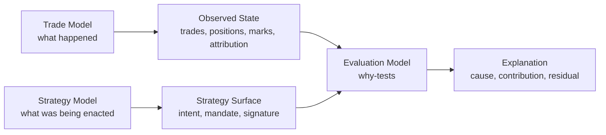
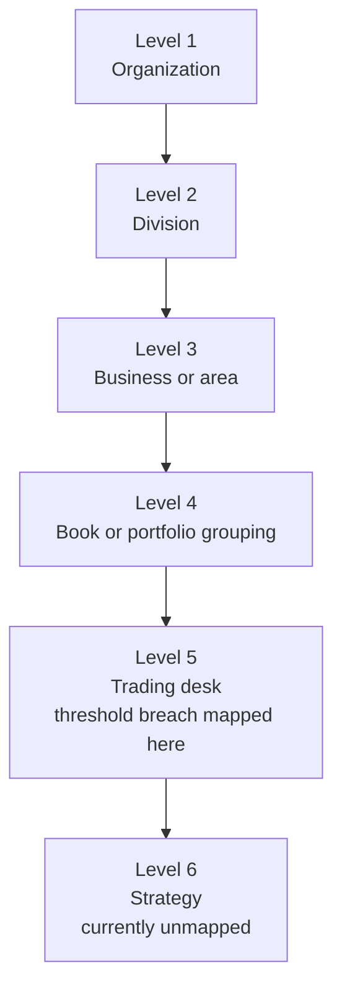
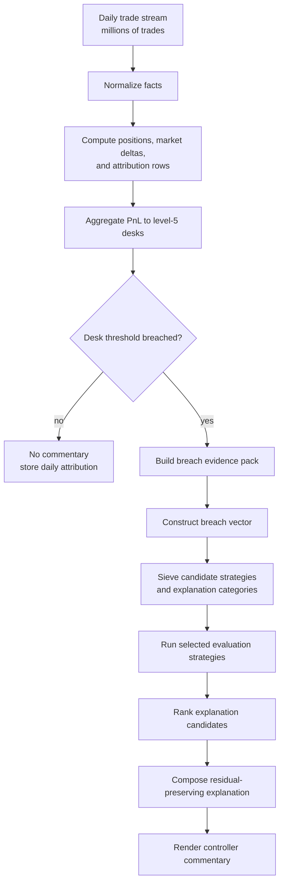

# Design Note: Strategy-Breach Explanation As Evaluation Strategy

**Date**: 2026-05-27
**Author**: codex
**Status**: Design commentary. Not ratified specification.
**Change class**: `design_reframe`
**Related authority seed**: `specification/BOOTSTRAP.md`
**Related provenance**: `.ai-workspace/comments/claude/20260523T144237Z_DESIGN_eval_authoring_to_fd_compilation_pipeline.md`

## Position

The simple framing is:

```text
Evals tell why a strategy is breaching.
```

More precisely:

```text
Threshold breach = coarse level-5 trading-desk alert.
Strategy = level-6 behavior or intent, often unmapped.
Eval = evaluation strategy that tests one possible reason why the strategy
       caused or contributed to the breach.
```

The product-controller workflow starts with a coarse desk-level threshold
breach, then asks: which strategy or strategies under the desk were being
enacted, and why did those strategies produce the breach?

Evals are not just threshold predicates. They are governed diagnostic
strategies for explanation categories: market shift, backdate, manual
adjustment, corrected market data, hedge slippage, quality basis movement,
strategy drift, and similar controller reasoning patterns.

## Three Pillars

The product should be organized around three pillars:

1. **Trade model**: what happened in the trade stream.
2. **Strategy model**: what strategy or mandate was being enacted over the
   trade manifold.
3. **Evaluation model**: why-tests that diagnose how the strategy caused or
   contributed to the threshold breach.



The authority boundary:

```text
Trade model owns observed facts.
Strategy model owns intended or allowed behavior.
Evaluation model owns diagnostic strategies and explanation candidates.
```

## Threshold Hierarchy

Threshold breaches are mapped at level 5, the trading-desk level. The real
explanatory behavior often lives at level 6, the strategy level. Level 6 is
currently unmapped.



This asymmetry matters:

```text
Threshold breach authority sits at level 5.
Explanatory causality often sits at level 6.
The system must reconstruct level-6 strategy explanations from level-5 alerts.
```

## Eval Meaning

An Eval is an evaluation strategy, not merely a predicate.

```text
Eval = explanation category + diagnostic procedure + required evidence
```

Some Evals are simple predicates. Others are multi-step numerical tests. In
controller language, an Eval is a codified diagnostic move:

```text
Did the strategy breach because the market moved?
Did it breach because the curve shifted against the position?
Did it breach because hedge slippage increased residual exposure?
Did it breach because a backdated trade entered the window?
Did it breach because an adjustment was posted?
Did it breach because observed trades drifted from the declared strategy?
```

Example categories:

| Explanation category | Evaluation strategy |
| - | - |
| Market shift between purchase and current state | Compare purchase-time market snapshot, current market snapshot, position marks, and factor attribution over the breach span |
| Backdated trade or amendment | Compare lifecycle event time, economic effective date, booking timestamp, and attribution inclusion window |
| Manual adjustment | Reconcile adjustment records to unexplained PnL movement and approval / reason-code lineage |
| Late or corrected market data | Compare original snapshot, corrected snapshot, valuation rerun, and attribution delta |
| Hedge slippage | Compare expected hedge ratio to observed hedge changes and residual factor exposure |
| Quality or basis movement | Compare cargo terms, quality differential curves, basis movements, and mark-position changes |
| Strategy drift | Compare observed trade stream and position changes to the declared or inferred strategy surface |

## Scaled Computation

For a daily million-trade run, the system should not run every Eval against
every trade and every strategy. It should compute daily state once, detect
coarse level-5 breaches, then run strategy explanation only for breached desks.



The computational target:

```text
O(number_of_trades) for daily attribution and desk aggregation
+ O(number_of_breached_desks * candidate_strategies * selected_eval_strategies)
```

not:

```text
O(number_of_trades * strategies * evals)
```

## Evidence Pack

For each breached desk, define one shared evidence pack. Evaluation strategies
consume this pack; they should not each rescan raw history.

```text
X_b = {
  breach_id,
  desk_id,
  breach_span,
  threshold_ref,
  observed_pnl,
  threshold_limit,

  trade_slice,
  attribution_slice,
  mark_position_snapshots,
  market_snapshots,
  lifecycle_events,
  adjustments,

  top_pnl_contributors,
  top_factor_contributors,
  top_lifecycle_flags,
  candidate_strategy_refs
}
```

## Vector-Generic Implementation Strategy

The scaled implementation should be described mathematically as vector
construction, projection, sieving, evaluation, and residual accounting.

Let:

```text
B = set of desk-level threshold breaches
T = set of trades
M = set of market observations
P = set of mark-position snapshots
A = set of attribution observations
L = set of lifecycle events
S = set of strategy signatures
K = set of explanation categories
E = set of evaluation strategies
```

For each breach `b in B`:

```text
span(b) = [t_start, t_end]
```

and:

```text
X_b = evidence pack over span(b)
```

Define feature maps:

```text
phi_trade       : X_b -> V_trade
phi_position    : X_b -> V_position
phi_market      : X_b -> V_market
phi_attribution : X_b -> V_attribution
phi_lifecycle   : X_b -> V_lifecycle
phi_threshold   : X_b -> V_threshold
```

The breach signature:

```text
v_b =
  phi_trade(X_b)
  + phi_position(X_b)
  + phi_market(X_b)
  + phi_attribution(X_b)
  + phi_lifecycle(X_b)
  + phi_threshold(X_b)
```

This can be a structured vector with typed blocks, units, sparsity, and
missing-value law. It does not need to be one dense vector.

Strategy signatures:

```text
s_j in V_strategy
```

where each `s_j` describes expected behavior:

```text
s_j = {
  product_scope_vector,
  expected_trade_pattern_vector,
  expected_position_delta_vector,
  expected_market_sensitivity_vector,
  expected_hedge_behavior_vector,
  expected_lifecycle_pattern_vector,
  expected_pnl_driver_vector
}
```

Explanation category signatures:

```text
k_i in V_explanation
```

Examples:

```text
market_shift
backdate
manual_adjustment
late_market_data
hedge_slippage
quality_basis_move
strategy_drift
```

## Projection And Sieving

Project before evaluating:

```text
pi_strategy    : V_breach -> U_strategy
pi_explanation : V_breach -> U_explanation
pi_risk        : V_breach -> U_risk
pi_lifecycle   : V_breach -> U_lifecycle
```

Candidate strategies:

```text
C_S(b) = top_n { s_j in S | d_strategy(pi_strategy(v_b), pi_strategy(s_j)) small }
```

Candidate explanation categories:

```text
C_K(b) = top_m { k_i in K | d_explanation(pi_explanation(v_b), k_i) small }
```

The distance functions are explicit domain objects:

```text
d_strategy
d_explanation
d_risk
d_lifecycle
```

They may combine exact bucket matches, weighted numerical distance, direction
agreement, sign agreement, exposure overlap, lifecycle compatibility, and
temporal overlap.

Staged sieve:

```text
Stage 0: hierarchy filter
  keep candidates compatible with organization, division, book, and desk

Stage 1: product and scope filter
  keep candidates compatible with product, tenor, region, and mandate

Stage 2: exposure overlap
  keep candidates whose exposure signature overlaps observed position delta

Stage 3: market-move compatibility
  keep candidates whose sensitivities match observed market shifts

Stage 4: lifecycle compatibility
  keep candidates consistent with backdates, amendments, rolls, cancels,
  corrections, or adjustments observed in the span

Stage 5: explanation-category selection
  keep only evaluation strategies relevant to surviving categories
```

## Evaluation Functions

Each evaluation strategy is a typed function:

```text
e_i : X_b x C_S(b) -> Y_i
```

where `Y_i` is an explanation candidate:

```text
Y_i = {
  explanation_category,
  strategy_candidate_ref,
  explained_amount,
  residual_amount,
  evidence_refs,
  diagnostic_trace,
  closure_status
}
```

Some strategies do not need a strategy candidate:

```text
e_adjustment : X_b -> Y_adjustment
e_backdate   : X_b -> Y_backdate
```

Others are strategy-relative:

```text
e_strategy_drift : X_b x s_j -> Y_strategy_drift
e_hedge_slippage : X_b x s_j -> Y_hedge_slippage
```

The distinction:

```text
explanation category = what kind of cause is being tested
evaluation strategy  = how that cause is tested
strategy signature   = which trading intent or behavior is being compared
```

## Residual Accounting

The explanation must preserve explained and unexplained PnL:

```text
observed_breach_amount =
  sum(explained_amount_i for accepted explanation candidates)
  + residual_amount
```

The system should not force closure. A valid result may be:

```text
market_shift explains 62%
manual_adjustment explains 11%
hedge_slippage explains 8%
strategy_drift candidate explains 6%
residual remains 13%
```

Residual is a first-class output, not a failure of the model.

Ranking should be explicit and replayable:

```text
rho(y) =
  w_1 * explained_amount_score(y)
  + w_2 * evidence_strength(y)
  + w_3 * strategy_match_score(y)
  + w_4 * temporal_alignment_score(y)
  - w_5 * residual_penalty(y)
  - w_6 * contradiction_penalty(y)
```

The final commentary is a projection from structured output:

```text
render : {Y_1, ..., Y_n, residual} -> Commentary
```

The commentary does not create new facts. It renders accepted evidence,
strategy candidates, explanation categories, explained amounts, and residual.

## Worked Example: Coal Desk Trading A Curve

Assume a thermal coal desk breaches a level-5 threshold. The likely level-6
behavior is a curve-trading strategy.

```text
b = thermal_coal_desk_threshold_breach
span(b) = [t_0, t_1]
```

The desk trades cargoes and paper instruments driven by a benchmark forward
curve plus basis terms:

```text
C(t, tau) = benchmark coal forward curve at time t for tenor tau
Q(t, tau) = quality differential curve
R(t, tau) = regional or location basis curve
F(t, tau) = freight curve
X(t)      = FX curve or rate
```

Market movement:

```text
Delta C(tau) = C(t_1, tau) - C(t_0, tau)
Delta Q(tau) = Q(t_1, tau) - Q(t_0, tau)
Delta R(tau) = R(t_1, tau) - R(t_0, tau)
Delta F(tau) = F(t_1, tau) - F(t_0, tau)
Delta X      = X(t_1) - X(t_0)
```

Observed position vector:

```text
p_b = {
  physical_tons_by_tenor,
  paper_lots_by_tenor,
  hedge_lots_by_tenor,
  quality_exposure_by_tenor,
  freight_exposure_by_tenor,
  FX_exposure
}
```

Candidate curve strategy signature:

```text
s_curve = {
  strategy_type: curve_trade,
  benchmark_scope,
  tenor_buckets,
  expected_curve_exposure,
  expected_basis_exposure,
  expected_hedge_ratio,
  expected_holding_period,
  allowed_residual,
  prohibited_lifecycle_patterns
}
```

If level 6 is unmapped, `s_curve` is an inferred candidate rather than admitted
strategy authority.

Project the forward curve into basis components:

```text
g_0 = level
g_1 = slope
g_2 = curvature
g_3...g_n = tenor-local shape components
```

Then:

```text
curve_move_vector =
  [<Delta C, g_0>, <Delta C, g_1>, <Delta C, g_2>, ..., <Delta C, g_n>]

strategy_exposure_vector =
  [exposure_to_level, exposure_to_slope, exposure_to_curvature, ...]
```

The first strategy sieve:

```text
curve_strategy_match =
  similarity(
    pi_curve(v_b),
    pi_curve(s_curve)
  )
```

where `pi_curve` keeps product, tenor, curve-shape, hedge, and basis dimensions.

Evaluation strategies for this breach:

| Explanation category | Evaluation strategy |
| - | - |
| Benchmark curve market shift | Compare curve exposure vector to `Delta C`; decompose PnL by level, slope, curvature, and tenor-local moves |
| Roll-down or carry mismatch | Compare expected roll-down over `span(b)` to observed mark-position movement |
| Quality basis movement | Compare quality exposure to `Delta Q` and cargo quality terms |
| Location or freight basis movement | Compare regional and freight exposure to `Delta R` and `Delta F` |
| Hedge slippage | Compare expected hedge ratio to observed physical and paper hedge changes |
| Backdated cargo or amendment | Compare lifecycle event time, economic effective date, and attribution inclusion window |
| Manual adjustment | Reconcile adjustment records against unexplained movement |
| Strategy drift | Compare observed position and trade pattern to `s_curve` |

Suppose observed PnL movement is `-12.4m` against a desk threshold of `-8.0m`:

```text
accepted explanation candidates:
  benchmark curve shift     = -7.1m
  quality basis movement    = -1.8m
  hedge slippage            = -1.2m
  backdated amendment       = -0.6m
  residual                  = -1.7m
```

The result should preserve decomposition:

```text
threshold breach = desk-level event
strategy candidate = coal curve trade
primary explanation = benchmark curve shift
secondary explanations = quality basis movement, hedge slippage, backdated amendment
residual = unexplained or unmapped
```

Controller commentary rendered from the structured evidence:

```text
The thermal coal desk breached its desk-level PnL threshold over [t_0, t_1].
The active curve-trading strategy candidate carried material exposure to the
benchmark curve slope and Q3/Q4 tenor buckets. The benchmark curve move explains
7.1m of the 12.4m movement, mostly through slope and tenor-local moves. Quality
basis movement explains 1.8m. Hedge slippage explains 1.2m. A backdated
amendment contributes 0.6m through inclusion-window timing. The remaining 1.7m
is residual and should be reviewed as unmapped strategy or data/model residual.
```

## Learning Loop

Repeated residual patterns should become new mathematical objects:

```text
residual_cluster -> candidate explanation category
residual_cluster -> candidate strategy signature
residual_cluster -> candidate evaluation strategy
```

Promotion is how the system learns without making the runtime explanation path
opaque. A repeated unexplained shape becomes a candidate vector signature or
evaluation strategy, then later an admitted strategy or diagnostic rule if it
survives review.

## Commentary Scope As Cost Dial

The same architecture can operate at different commentary scopes. Commentary
scope is a policy choice, not an architecture limit.

Narrow scope:

```text
comment only on breached level-5 desks
```

Broader scopes:

```text
comment on breached desks
comment on near-breach desks
comment on all desks with material strategy movement
comment on all strategies with unusual drift
comment on all residual clusters above a declared threshold
comment on all strategy / desk / day combinations within a surveillance budget
```

The trigger does not have to be a threshold breach. Threshold breach is one
trigger type among many:

```text
level-5 threshold breach
near breach
large market move
large position change
large mark-position movement
strategy drift
hedge slippage
unexplained residual
backdate concentration
manual adjustment cluster
new residual cluster
```

This turns the product from a breach explainer into a general risk-management
system:

```text
Trade stream
  -> strategy signatures
  -> evidence packs
  -> evaluation strategies
  -> explanation candidates
  -> residuals
  -> commentary
```

The same machinery supports:

```text
post-breach explanation
pre-breach early warning
desk strategy monitoring
mandate compliance
hedge effectiveness monitoring
market-move attribution
operational-risk detection
model and data-quality surveillance
portfolio intelligence
```

The tradeoff is compute cost. Widening the commentary aperture means widening
one or more of:

```text
which desks
which strategies
which explanation categories
which residual thresholds
which near-miss bands
which market regimes
which time windows
```

The design should therefore expose commentary scope as an explicit policy:

```text
CommentaryPolicy {
  trigger_set
  desk_scope
  strategy_scope
  explanation_category_scope
  residual_threshold
  near_miss_threshold
  time_window
  commentary_budget
}
```

## Execution Policy And Engine Neutrality

The mathematical pipeline is engine-neutral:

```text
evidence packs
  -> vectors
  -> projection and sieve
  -> selected evaluation strategies
  -> residual accounting
  -> commentary
```

Spark-style distributed batch is one possible realization, especially for
large daily attribution, joins, and desk-level reductions. It should not be
encoded as the architecture. Other execution families may fit parts of the
workload better:

```text
batch distributed:
  large daily attribution, deep replay, heavy joins and aggregation

in-memory columnar:
  breached-desk evidence packs, fast local explanation, analyst drilldown

streaming or incremental:
  intraday monitoring, rolling windows, early warning, mark-position changes

OLAP / serving:
  dashboard slices, portfolio surveillance, historical residual exploration
```

Choose execution by run policy:

```text
ExecutionPolicy {
  scope
  trigger
  data_volume
  latency_target
  state_size
  replay_depth
  commentary_budget
  engine_class
}
```

Example policies:

```text
EOD controller batch:
  trigger = end_of_day
  scope = all desks
  engine_class = batch_columnar or distributed_batch

Intraday risk monitoring:
  trigger = event_time_window
  scope = selected desks or strategies
  engine_class = streaming_incremental

Breached-desk explanation:
  trigger = level-5 breach
  scope = breached desk evidence pack
  engine_class = in_memory_columnar or bounded batch

Analyst investigation:
  trigger = human_query
  scope = selected desk / strategy / time span
  engine_class = in_memory_columnar or OLAP

Portfolio surveillance:
  trigger = scheduled rolling window
  scope = broad desk and strategy set
  engine_class = distributed_batch, streaming_incremental, or OLAP
```

The key design requirement is execution polymorphism. The explanatory objects
must remain stable while the execution engine varies by cost, latency, volume,
and commentary scope.

## Design Implication

The next design pass should name these surfaces explicitly:

```text
Trade State
Strategy State
Evaluation Strategy State
Explanation Candidate State
Residual State
```

`StrategySurface` or equivalent should become an explicit domain asset and
runtime authority surface. Evals should reference strategy candidates or
strategy surfaces by stable ref and version where available.

The core law:

```text
Evals are why-tests over strategies.
They explain why the strategy breached the level-5 threshold.
```
