# Design Note: Homeostatic Trade Continuum Architecture

**Date**: 2026-07-09
**Author**: codex
**Status**: Design commentary. Not ratified specification.
**Change class**: `design_reframe`
**Related authority seed**: `specification/BOOTSTRAP.md`
**Related provenance**:
- `specification/cdm_trade_continuum_strategy.md`
- `specification/cdm_trade_continuum_cuda_stack_proposal.md`
- `.ai-workspace/comments/codex/20260527T011146Z_DESIGN_three_pillars_trade_strategy_eval.md`

## Posting Boundary

This post treats the existing CDM-native trade continuum and CUDA stack as the
domain substrate, then lifts the homeostatic / Conant-Ashby insight into the
architectural control model.

The source pattern is:

```text
A good regulator must contain a model of the thing regulated.
```

FINOS CDM remains the canonical financial transaction and lifecycle spine. It
is not the whole semantic universe. This project already defines the core
continuum from strategy to expected gain vector to trade intent to execution to
CDM event to actual gain vector to P&L, risk, and projection. The companion GPU
proposal frames the runtime as a typed, versioned, event-driven dependency
graph.

This post is commentary. Ratification would require an explicit re-entry
decision because the homeostatic framing broadens the control model around the
current trade-continuum architecture.

## 1. Executive Thesis

The architecture should be understood as a **homeostatic financial organism**.

It maintains an internal model of what "good" looks like, observes internal and
external reality through telemetry, computes the gap between the two, and
generates intent as directed pressure to reduce, exploit, or reprice that gap.

In cybernetic terms, this is a Conant-Ashby architecture: a good regulator must
contain a model of the system it regulates. The extension here is that the model
is not merely descriptive. It is normative. It encodes viability, value, risk
appetite, obligations, strategy, and desired economic state.

The core loop is:

```text
homeostatic model
  -> telemetry
  -> gap / delta
  -> intent
  -> action
  -> world change
  -> new telemetry
  -> model update or re-entry
```

Applied to trading:

```text
model of good portfolio / book / strategy state
  -> market, portfolio, execution, lifecycle, risk, P&L telemetry
  -> gain/risk/control gap
  -> trade intent / hedge intent / reprice intent / governance intent
  -> execution, booking, valuation, commentary, control action
  -> updated trade continuum
```

This reframes the platform from a collection of trading systems into a
**regulated semantic organism**.

The system does not merely capture trades.

It captures why the trade exists, what gain vector was expected, what actually
happened, what changed, and what the organism now intends to do.

## 2. Architectural North Star

The north star is a single semantic continuum:

```text
MarketplaceState
  -> StrategyAlgorithm
  -> ExpectedGainVector
  -> TradeIntent
  -> Order / Execution
  -> CDM BusinessEvent
  -> CDM TradeState
  -> PositionState
  -> ValuationState
  -> ActualGainVector
  -> AttributionVector
  -> P&L / Risk / GL / Regulatory / Commentary projections
```

The homeostatic extension adds the control loop around that continuum:

```text
HomeostaticModel
  -> Observe(WorldState)
  -> ComputeGap(ModelState, ObservedState)
  -> GenerateIntent(Gap)
  -> SelectAction(Intent)
  -> ApplyAction(World)
  -> Observe(WorldState')
  -> Learn / Reprice / Re-enter
```

The architecture therefore has two intertwined dimensions:

```text
Trade continuum:
  how economic reality is represented and projected

Homeostatic loop:
  how the platform evaluates reality and generates intent
```

The result is not just a trade algebra.

It is a **trade-regulation algebra**: an executable model of how a financial
organism maintains viability while acting in markets.

## 3. Core Conceptual Model

### 3.1 Homeostatic model

The `HomeostaticModel` is the encoded representation of what good means.

It is not a single objective function. It is a structured viability manifold
containing:

```text
risk appetite
capital limits
liquidity limits
inventory targets
strategy objectives
expected gain profiles
regulatory obligations
market conduct constraints
desk mandates
P&L expectations
model-risk tolerances
operational SLAs
data-quality requirements
lineage and audit obligations
```

This is the internal model against which reality is judged.

### 3.2 Telemetry

Telemetry is the organism's sensory system.

It includes external telemetry:

```text
market data
order book state
venue state
curves
vol surfaces
spreads
basis
FX
rates
credit
news / events / operational signals
```

And internal telemetry:

```text
positions
orders
fills
CDM business events
trade states
valuation states
risk states
P&L explain
cashflows
margin/collateral
model versions
data freshness
lineage completeness
control breaches
runtime health
```

### 3.3 Gap

A gap is the difference between the homeostatic model and observed reality.

It can be economic:

```text
expected gain vector differs from actual gain vector
risk exposure exceeds appetite
execution deviates from intended exposure
basis moves against the book
hedge effectiveness deteriorates
```

It can be semantic:

```text
trade lacks strategy lineage
gain vector basis is missing
projection is lossy but treated as authoritative
CDM lift is incomplete
P&L cannot be traced to strategy run
```

It can be operational:

```text
SLA drift
late lifecycle event
stale market data
failed valuation
missing confirmation
broken lineage
```

It can be constitutional:

```text
requirement no longer matches reality
policy conflicts with profitable action
model assumption has expired
control state blocks execution
```

### 3.4 Intent

Intent is directed pressure generated by the gap.

Intent is not a human wish and not merely an order instruction. It is a
first-class runtime object.

Examples:

```text
TradeIntent
HedgeIntent
RebalanceIntent
RepriceIntent
InvestigateIntent
BlockIntent
EscalateIntent
RepairLineageIntent
RefreshMarketDataIntent
UpdateModelIntent
RegenerateCommentaryIntent
```

A trading strategy is therefore a homeostatic regulator:

```text
StrategyAlgorithm :
  MarketplaceState x PortfolioState x HomeostaticModel x Constraints x Parameters
    -> Intent x ExpectedGainVector
```

### 3.5 Action

Action is the materialization of intent.

Actions may include:

```text
submit order
cancel order
book trade
amend trade
generate CDM business event
revalue position
hedge exposure
request human approval
raise control event
rerun projection
update model parameter
open investigation
generate commentary
block downstream publication
```

### 3.6 Learning and re-entry

When the same gap repeats, the system should not merely act again.

It should ask whether the model of good is wrong, stale, incomplete, or
under-specified.

This gives the architectural loop:

```text
gap -> action
gap persists -> re-entry
gap exceeds local graph -> constitutional re-entry
gap invalidates assumption -> reprice model
gap invalidates requirement -> update specification
```

This aligns with the GTL/ABG pattern: local runtime traversal remains lawful,
but homeostatic pressure can route the system to re-entry, repricing,
refactoring, or constitutional change without corrupting runtime truth.

## 4. Target Architecture

```mermaid
flowchart TB
    subgraph World[World / Market / Enterprise Reality]
        MKT[Market Data & Venue State]
        BOOK[Portfolio / Position / Inventory State]
        EXEC[Orders / Executions / Fills]
        LIFE[Lifecycle Events / Confirmations / Settlements]
        OPS[Operational / SLA / Data Quality Telemetry]
    end

    subgraph Spine[CDM Semantic Spine]
        CDM[CDM Trade & Lifecycle State]
        CBE[CDM Business Events]
        LEGAL[Legal / Economic Terms]
    end

    subgraph Extensions[Strategy + Gain Vector Extensions]
        STRAT[StrategyDefinition]
        RUN[StrategyRun]
        EGV[ExpectedGainVector]
        AGV[ActualGainVector]
        ATTR[AttributionVector]
        BASIS[GainVectorBasis Registry]
    end

    subgraph Homeostasis[Homeostatic Control Plane]
        GOOD[Model of Good / Viability Manifold]
        OBS[Telemetry Normalizer]
        GAP[Gap Evaluator]
        INTENT[Intent Generator]
        POLICY[Policy / Governance / Model Risk]
        REENTRY[Re-entry / Reprice / Block / Escalate]
    end

    subgraph Graph[Evented Dependency Graph Runtime]
        NODES[Typed Nodes]
        EDGES[Semantic Edges]
        DIRTY[Dirty Propagation]
        REPLAY[Replay / Snapshots]
        LINEAGE[Lineage]
    end

    subgraph Compute[Compute Plane]
        CPU[CPU Semantic Services]
        GPU[GPU Scenario / Valuation / Optimization]
        ANALYTICS[Pricing / Risk / Attribution]
    end

    subgraph Projections[Projection Surfaces]
        PNL[P&L Explain]
        RISK[Risk Explain]
        GL[GL / Accounting]
        REG[Regulatory]
        UI[Trader / Ops UI]
        COMM[Commentary]
        AUDIT[Audit / Evidence]
    end

    World --> OBS
    OBS --> GAP
    GOOD --> GAP
    GAP --> INTENT
    INTENT --> POLICY
    POLICY --> REENTRY
    REENTRY --> Graph

    World --> Spine
    Spine --> Extensions
    Extensions --> Graph
    Graph --> Compute
    Compute --> Graph
    Graph --> Projections
    Spine --> Projections
    Extensions --> Projections

    Projections --> OBS
```



## 5. Major Architectural Layers

### Layer 0 - Event and telemetry substrate

Purpose: ingest reality.

This layer captures all external and internal signals as versioned,
timestamped, source-attributed events.

Inputs include:

```text
market data
reference data
strategy configuration
model parameters
orders
executions
fills
CDM lifecycle events
valuation runs
risk runs
P&L explains
control events
runtime events
SLA events
human approvals
```

Rule:

```text
Nothing becomes runtime truth merely because a provider emitted it.
It becomes runtime truth when admitted into the evented semantic substrate.
```

This mirrors the ABG position: providers can produce effects, but admission
governs truth.

### Layer 1 - CDM semantic spine

Purpose: preserve legal and economic trade meaning.

CDM remains the canonical representation of:

```text
product economics
trade state
business events
legal/economic lifecycle
settlement terms
contractual obligations
```

The architecture should not overload CDM with strategy concepts.

Instead:

```text
CDM = what the trade is
Strategy extension = why the trade exists
Gain vector = what transformation was intended or realized
Projection = how a consumer sees the continuum
```

Design invariant:

```text
Strategy and gain-vector extensions may explain, reference, group, or generate CDM states.
They must not corrupt CDM trade semantics.
```

FINOS CDM is positioned as a standardised, machine-readable and
machine-executable model for financial products and transaction lifecycle
management, which makes it the natural spine for this architecture.

### Layer 2 - Strategy and gain-vector extension layer

Purpose: make intent first-class.

Core objects:

```text
StrategyDefinition
StrategyRun
StrategyAlgorithmReference
MarketplaceStateReference
PortfolioStateReference
HomeostaticModelReference
TradeIntent
ExecutionPreference
GainVectorBasis
ExpectedGainVector
ExecutedGainVector
ActualGainVector
AttributionVector
ProjectionContract
LineageReference
```

Core function:

```text
StrategyAlgorithm :
  MarketplaceState
  x PortfolioState
  x HomeostaticModel
  x Parameters
  x Constraints
    -> TradeIntent x ExpectedGainVector
```

Observation function:

```text
ObserveGain :
  State x Basis -> GainVector<Basis>
```

Attribution function:

```text
Attribute :
  ExpectedGainVector
  x ExecutedGainVector
  x ActualGainVector
    -> AttributionVector
```

Projection function:

```text
Project :
  ContinuumState x ProjectionContract -> ProjectionResult
```

The key design move is that `StrategyRun` becomes the central causal object.

It records:

```text
what was observed
what model was used
what gap was detected
what intent was generated
what gain vector was expected
what action occurred
what CDM state resulted
what gain vector was realized
what attribution explains the difference
```

### Layer 3 - Homeostatic control plane

Purpose: evaluate reality against the model of good.

Core objects:

```text
HomeostaticModel
ViabilityConstraint
TelemetryObservation
GapAssessment
IntentProposal
PolicyDecision
ReentryPlan
ModelUpdateProposal
ControlOutcome
```

The homeostatic model should support multiple constraint classes:

```text
economic constraints
risk constraints
capital constraints
liquidity constraints
regulatory constraints
model-risk constraints
operational constraints
data-quality constraints
semantic-integrity constraints
lineage constraints
```

Gap assessment:

```text
GapAssessment =
  observedState
  expectedState
  violatedConstraints
  gapVector
  severity
  confidence
  candidateIntents
  requiredAuthority
  lineage
```

Intent generation:

```text
IntentProposal =
  intentType
  targetState
  expectedEffect
  affectedContinuumNodes
  requiredActions
  expectedGainVectorDelta
  riskDelta
  controlImpact
  authorityRequired
```

The control plane should distinguish between:

```text
local correction
recomputation
revaluation
hedging
strategy repricing
requirement repricing
design reframe
realization refactor
human escalation
block
```

This is where the GTL/ABG re-entry taxonomy becomes operational.

### Layer 4 - Event-driven dependency graph runtime

Purpose: keep the continuum live.

The runtime should be a typed graph, not a batch pipeline.

Node shape:

```text
Node<T> =
  id
  type
  valueRef
  basis
  version
  validityInterval
  timestamp
  inputs[]
  functionRef
  lineage
  recomputationPolicy
  cachePolicy
  executionTarget
```

Edge shape:

```text
Edge =
  dependsOn
  observes
  generatedBy
  pricesWith
  hedges
  aggregatesInto
  projectsTo
  explains
  settlesInto
  violates
  repairs
  reprices
```

Runtime responsibilities:

```text
dirty propagation
incremental recomputation
lazy observation
topological scheduling
semantic validation
deterministic replay
event admission
lineage preservation
snapshotting
audit queries
cycle handling through staged or fixed-point evaluation
```

The graph is the organism's nervous system.

It knows what changed, what depends on it, what must be recomputed, and which
output projections are no longer valid.

### Layer 5 - Compute plane

Purpose: perform expensive numerical work without losing semantic meaning.

CPU responsibilities:

```text
CDM validation
lifecycle event construction
semantic graph management
policy checks
lineage
projection contract validation
workflow state
audit state
small branching decisions
```

GPU responsibilities:

```text
scenario paths
Monte Carlo valuation
risk-factor cubes
curve / vol / basis shock grids
large portfolio valuation
bump-and-revalue matrices
factor exposure matrices
portfolio optimization
strategy backtesting
order-book simulation
gain-vector computation
large aggregation / reduction workloads
```

RAPIDS provides GPU-accelerated data science libraries such as cuDF and cuML,
and NVIDIA cuDF is built on CUDA primitives to accelerate structured data
processing.

Boundary rule:

```text
The GPU computes values.
The semantic layer defines meaning.
```

Never send arbitrary CDM object graphs to the GPU.

Instead:

```text
CDMTradeState[]
  -> semantic work package
  -> columnar arrays / tensors
  -> GPU kernel
  -> typed result batch
  -> ValuationState / GainVector nodes
```

### Layer 6 - Projection surfaces

Purpose: expose lawful views of the continuum.

Projection types:

```text
P&L explain
risk explain
GL/accounting
regulatory reporting
trader commentary
ops dashboard
model-risk report
lineage/audit report
strategy performance report
execution-quality report
```

Every projection must declare:

```text
input type
output type
basis
transform
fidelity
lossiness
consumer
validation rules
version
lineage
```

Projection invariant:

```text
A projection may be incomplete, but it must not be dishonest.
```

For example:

```text
pi_pnl :
  ActualGainVector x AttributionVector -> PnLExplain

pi_comment :
  AttributionVector x DeskContext -> TraderCommentary

pi_reg :
  CDMTradeState x EventHistory x RegulatoryRuleSet -> RegulatoryReport

pi_risk :
  PositionState x MarketState x ModelVersion -> RiskReport
```

## 6. Homeostatic Runtime Cycle

The platform runtime should follow this cycle:

```text
1. Admit telemetry.
2. Normalize telemetry into typed observations.
3. Compare observations against the homeostatic model.
4. Produce gap assessments.
5. Generate candidate intents.
6. Evaluate candidate intents against policy and authority.
7. Select action or re-entry route.
8. Apply action through graph/runtime.
9. Recompute affected nodes.
10. Publish updated projections.
11. Preserve lineage and replay evidence.
12. Update model or requirements when repeated gaps indicate model failure.
```

In pseudo-code:

```text
on TelemetryAdmitted(event):
  observation = normalize(event)
  affectedModels = resolveHomeostaticModels(observation)
  gaps = evaluateGaps(affectedModels, observation)

  for gap in gaps:
    intent = generateIntent(gap)
    decision = govern(intent)

    match decision:
      allow:
        applyIntent(intent)
      reprice:
        createReentryPlan(intent, target="intent|requirement|model")
      block:
        publishBlock(intent)
      escalate:
        requestAuthority(intent)

  recomputeAffectedGraph()
  publishProjectionsWithLineage()
```

The critical point:

```text
Intent arises from evaluated gap, not from telemetry alone.
```

## 7. Domain Mapping: Trading Examples

### 7.1 Commodity basis strategy

Homeostatic model:

```text
desired exposure:
  long Brent-Dubai basis widening
  neutral flat-price exposure
  bounded FX exposure
  bounded storage/carry cost
```

Telemetry:

```text
Brent curve
Dubai curve
basis spread
inventory state
executed fills
funding rate
FX rate
position state
P&L explain
```

Gap:

```text
actual basis exposure lower than intended
execution slippage higher than expected
flat-price neutrality breached
```

Intent:

```text
rebalance spread
hedge flat price
adjust execution tactic
raise slippage attribution
```

Projection:

```text
P&L Explain:
  basis: +X
  flat price: -Y
  funding: -Z
  execution slippage: -A
  residual: B
```

### 7.2 Derivative volatility strategy

Homeostatic model:

```text
desired:
  long gamma
  long vega
  delta neutral
  theta cost within tolerance
  model residual controlled
```

Telemetry:

```text
underlier price
vol surface
skew
hedge fills
option valuation
Greeks
actual P&L
```

Gap:

```text
delta drifted
vol move differed from scenario
theta burn exceeded expected profile
model residual widened
```

Intent:

```text
delta hedge
reprice volatility surface
reduce exposure
escalate model residual
```

### 7.3 P&L explain as homeostatic evidence

A P&L number should never be treated as a naked scalar.

It should be a projection of actual gain and attribution:

```text
P&LExplain =
  pi_pnl(ActualGainVector, AttributionVector)
```

The audit question should always be answerable:

```text
Given this P&L number:
  which strategy run generated it?
  which expected gain vector motivated it?
  which execution created it?
  which CDM event captured it?
  which trade state produced the position?
  which valuation model priced it?
  which market data moved it?
  which actual gain vector explains it?
  which projection contract rendered it?
```

## 8. Governance and Assurance Model

This architecture should be governed as a model-risk and audit system from the
start.

Versioned objects:

```text
HomeostaticModel
StrategyDefinition
StrategyAlgorithm
StrategyRun
GainVectorBasis
ProjectionContract
CDM Lift Mapping
ValuationModel
MarketDataSnapshot
ParameterSet
KernelVersion
PolicyRule
TelemetryNormalizer
GapEvaluator
IntentGenerator
```

Assurance invariants:

```text
No intent without gap.
No gap without telemetry and model reference.
No gain vector without declared basis.
No P&L explain without actual gain vector and attribution.
No projection without fidelity declaration.
No regulatory output without CDM lineage.
No published result without replayable evidence.
No model update without authority.
```

This turns governance into runtime structure rather than after-the-fact
documentation.

## 9. Minimum Viable Build

The first build should be narrow but end-to-end.

Recommended MVP:

```text
Homeostatic commodity basis strategy continuum
```

Why this works:

```text
commodities expose basis, curve, location, storage, carry, FX, and physical optionality
gain vectors are naturally multidimensional
CDM can remain the trade/lifecycle spine
GPU scenario and valuation workloads are plausible
P&L explain becomes visibly better than scalar reconstruction
```

MVP flow:

```text
MarketDataSnapshot
  -> HomeostaticModel
  -> StrategyRun
  -> ExpectedGainVector
  -> TradeIntent
  -> SimulatedExecution
  -> CDM BusinessEvent
  -> CDM TradeState
  -> PositionState
  -> ScenarioValuation
  -> ActualGainVector
  -> AttributionVector
  -> P&L Explain
  -> Homeostatic Gap Assessment
```

MVP deliverables:

```text
1. StrategyDefinition schema
2. HomeostaticModel schema
3. GainVectorBasis registry
4. ExpectedGainVector and ActualGainVector objects
5. CDM reference/lift layer
6. Evented graph runtime skeleton
7. GapEvaluator
8. IntentGenerator
9. P&L projection contract
10. Lineage trace from P&L back to strategy and market state
```

MVP success criteria:

```text
A user can ask:
  "Why did this P&L number change?"

And the system can answer:
  "Because this market/basis move changed this valuation state,
   which changed this actual gain vector,
   which differed from this expected gain vector,
   generated by this strategy run,
   based on this marketplace state,
   resulting in this attribution."
```

## 10. Phased Roadmap

### Phase 0 - Terminology and boundary

Deliver:

```text
homeostatic model vocabulary
intent taxonomy
gap taxonomy
projection taxonomy
CDM extension boundary
first asset-class scope
```

Decision:

```text
CDM is the spine.
Strategy/gain/homeostasis are extensions.
Systems are projections.
```

### Phase 1 - Semantic object model

Deliver:

```text
HomeostaticModel
TelemetryObservation
GapAssessment
IntentProposal
StrategyDefinition
StrategyRun
GainVector
GainComponent
ProjectionContract
LineageReference
```

Success:

```text
A StrategyRun can explain its expected gain vector and the homeostatic gap that generated its intent.
```

### Phase 2 - CDM lift and lifecycle continuity

Deliver:

```text
TradeIntent -> ExecutionReference
ExecutionReference -> CDM BusinessEvent
CDM BusinessEvent -> CDM TradeState
TradeState -> PositionState
```

Success:

```text
Execution can be traced from homeostatic gap to intent to CDM event to position.
```

### Phase 3 - Actual gain and attribution

Deliver:

```text
ActualGainVector computation
Expected vs executed vs actual comparison
AttributionVector
Residual handling
Execution slippage model
```

Success:

```text
The model explains why actual gain differed from expected gain.
```

### Phase 4 - Projection and commentary

Deliver:

```text
P&L projection
risk projection
commentary projection
regulatory projection
audit projection
```

Success:

```text
P&L, risk, commentary, and reporting are projections over the same continuum.
```

### Phase 5 - Live graph and GPU compute

Deliver:

```text
event-driven dependency graph
dirty propagation
scenario valuation
GPU work-batch compiler
CPU/GPU validation harness
replay and lineage store
```

Success:

```text
A market-data change recomputes only affected nodes and preserves lineage.
```

### Phase 6 - Governance-grade homeostasis

Deliver:

```text
policy governance
model-risk workflow
authority gates
re-entry planning
requirement repricing
control-plane dashboards
audit-grade replay
```

Success:

```text
The platform can distinguish local correction from constitutional model change.
```

## 11. Architectural Warnings

### Do not make CDM carry everything

CDM should not become a dumping ground for strategy, homeostasis, or gain
semantics.

Use CDM as the canonical contract/lifecycle spine.

### Do not flatten gain vectors

A gain vector without a basis is ambiguous.

```text
GainVector without Basis = invalid
```

### Do not confuse P&L with gain

P&L is a projection.

Gain is the richer economic transformation.

### Do not treat strategy as metadata

Strategy is the applied algorithm.

A desk code is not a strategy.

### Do not treat telemetry as truth

Telemetry is observed.

Truth is admitted, typed, versioned, and replayable.

### Do not let compute erase meaning

GPU arrays are not the model.

They are accelerated numerical representations of typed semantic work packages.

### Do not generate intent without authority

Intent may be automatic.

Action must be governed.

## 12. Final Positioning

This architecture is not:

```text
a CDM mapper
a risk engine
a GPU quant library
a P&L explain tool
an order-management platform
a reporting layer
```

It is:

```text
a homeostatic semantic trade continuum
```

It combines:

```text
CDM-native lifecycle semantics
+ strategy/gain-vector extensions
+ homeostatic model of good
+ telemetry and gap evaluation
+ intent generation
+ evented dependency graph runtime
+ GPU-accelerated numerical compute
+ governed projection surfaces
+ replayable lineage
```

The shortest formulation:

> A financial platform should behave like a good regulator: it must contain a
> model of the market, the book, the trade lifecycle, and its own definition of
> good. Telemetry is compared against that model. The gap generates intent.
> Intent becomes action. Action changes the world. The resulting continuum is
> measured as expected and actual gain, projected into P&L, risk, accounting,
> regulatory evidence, and commentary.

The more technical formulation:

> Build a CDM-native, event-sourced, typed dependency graph in which strategy
> runs are homeostatic regulators. Each strategy run observes marketplace and
> portfolio state, evaluates a gap against a model of good, emits intent and
> expected gain vector, materializes through execution and CDM lifecycle events,
> produces actual gain vector and attribution, and exposes P&L, risk, GL,
> regulatory, commentary, and audit as lawful projections over one replayable
> semantic continuum.

The philosophical formulation:

> Meaningful agency is homeostatic regulation over a model of the good. In
> finance, the model of the good is a governed viability manifold; telemetry is
> market and book reality; intent is the gain/risk/control vector induced by the
> gap; and the trade continuum is the material history of the organism acting to
> restore, exploit, or revise its own viability.

## 13. Next Refinement

The next useful refinement is to collapse this commentary into a repo-ready
architecture surface with object schemas and a Mermaid diagram set, after a
re-entry decision determines whether this is product repricing, design reframe,
or a candidate future work-wave.

## References

- W. Ross Ashby and Roger C. Conant, "Every Good Regulator of a System Must be
  a Model of that System",
  <https://pespmc1.vub.ac.be/books/Conant_Ashby.pdf>
- FINOS Common Domain Model overview, <https://cdm.finos.org/docs/cdm-overview/>
- RAPIDS GPU Accelerated Data Science, <https://rapids.ai/>
