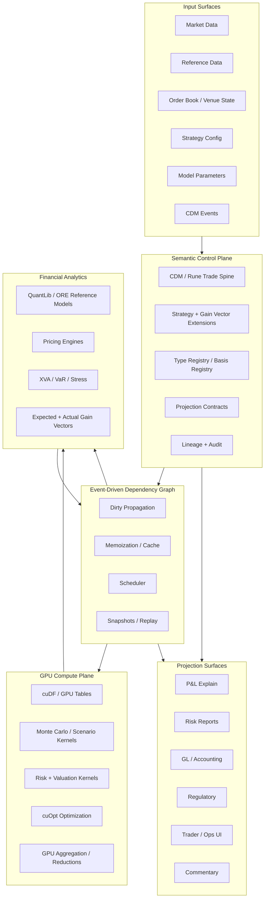

# CDM-Native Trade Continuum: CUDA/GPU Technical Stack Proposal

**Companion document to:** `cdm_trade_continuum_strategy.md`
**Date:** 2026-07-03
**Working name:** CDM-native GPU Trade Continuum Compute Layer
**Alternative names:** Trade Continuum Compute Stack, GPU Gain Vector Runtime, CDM Strategy Compute Fabric

---

## 1. Executive Summary

The trade-continuum strategy document defines a single semantic algebra:

```text
marketplace state
  -> strategy algorithm
  -> expected gain vector
  -> trade intent
  -> order / execution
  -> CDM business event
  -> CDM trade state
  -> position state
  -> valuation state
  -> actual gain vector
  -> P&L / risk / GL / regulatory / commentary projections
```

This companion document proposes the **technical stack** required to make that algebra executable at real-world scale.

The central claim is:

> A CDM-native trade continuum should be implemented as a typed, versioned, event-driven dependency graph. CDM provides the canonical trade/lifecycle spine. The strategy algebra provides intent and gain-vector semantics. CUDA/RAPIDS/cuOpt provide the massive parallel compute substrate for scenario, valuation, optimization, backtesting, and attribution workloads.

The stack is not “CUDA for CDM” in a narrow sense. CDM should remain the semantic contract/lifecycle layer. CUDA should accelerate the large numerical regions of the continuum:

```text
scenario paths
risk-factor cubes
Monte Carlo valuation
curve / vol / basis shock grids
portfolio aggregation
strategy backtesting
order-book simulation
optimization
expected / actual gain-vector computation
```

The result is a unified platform in which:

- strategy intent is preserved;
- CDM trade and lifecycle events remain canonical;
- risk, P&L, and commentary are lawful projections;
- only affected computations recompute when market, trade, model, or strategy inputs change;
- GPU acceleration is used where it has structural advantage;
- lineage connects every output back to strategy, market state, model version, CDM event, and valuation basis.

---

## 2. Relationship to the Trade Algebra Document

The strategy document defines the **language of meaning**. This document defines the **runtime and compute architecture**.

| Trade algebra concept | Stack implementation |
|---|---|
| `MarketplaceState` | Market data streams, reference data, order books, curves, vol surfaces, commodity bases, corporate actions |
| `StrategyAlgorithm` | Versioned strategy plugin: Python, C++, CUDA, model artifact, or rule package |
| `ExpectedGainVector` | Scenario/forecast projection node, often GPU-accelerated |
| `TradeIntent` | Typed intent object, mapped to order management, RFQ, execution, or booking workflows |
| `OrderSet / ExecutionSet` | FIX/OMS/EMS adapters, venue and broker execution streams |
| `CDMBusinessEvent` | CDM/Rune-compatible lifecycle event generated from execution or contractual event |
| `CDMTradeState` | Canonical trade-state object and lifecycle state store |
| `PositionState` | Incremental aggregation over CDM trade states and lifecycle events |
| `ValuationState` | Pricing/risk computation node, backed by ORE/QuantLib/custom pricing kernels/GPU kernels |
| `ActualGainVector` | Observation node comparing realized state to reference state in a declared basis |
| `Projection` | P&L explain, risk, GL, regulatory, commentary, UI/API surface |
| `Lineage` | Dependency graph provenance, model version, data version, strategy run, CDM event chain |

The trade algebra says:

```text
P&LExplain = π_pnl(ActualGainVector)
```

The stack says how to compute that live:

```text
input changes
  -> dependency graph marks affected nodes dirty
  -> scheduler batches affected numerical nodes
  -> GPU kernels compute scenarios / valuation / vectors
  -> semantic layer validates typed results
  -> projections update with lineage
```

---

## 3. Stack Thesis

The stack should be built around five separations.

### 3.1 Semantic layer vs compute layer

CDM objects, strategy definitions, gain-vector bases, projection contracts, and lifecycle rules live in the semantic layer.

CUDA kernels, RAPIDS tables, scenario cubes, reductions, and optimization routines live in the compute layer.

```text
Semantic layer decides what a computation means.
Compute layer executes the expensive numerical work.
```

### 3.2 Control plane vs data plane

The control plane schedules, validates, versions, and audits computations.

The data plane moves market data, arrays, scenarios, trade batches, and result matrices.

```text
Control plane: graph, lineage, policy, validation, scheduling.
Data plane: Arrow/cuDF arrays, GPU memory, scenario tensors, result cubes.
```

### 3.3 CDM spine vs strategy extension

CDM remains the canonical trade/lifecycle representation. Strategy and gain-vector objects are extensions around CDM, not replacements for CDM.

```text
CDM = what the trade legally/economically is.
Strategy extension = why the trade was generated.
Gain vector = what transformation was intended or realized.
```

### 3.4 Incremental graph vs batch pipeline

The system should not be a nightly batch pipeline with some GPU jobs attached. It should be a live dependency graph where changes trigger only the affected downstream nodes.

```text
market tick
trade amendment
model update
strategy parameter change
fixing / reset
settlement event
```

Each of these should invalidate and recompute a precise subgraph.

### 3.5 Typed projections vs disconnected reports

P&L, risk, accounting, regulatory reporting, and commentary should be typed projections of the continuum, not independent reconciliations.

```text
π_risk      : TradeContinuumState -> RiskReport
π_pnl       : GainVector -> PnLExplain
π_gl        : CashflowEvent -> LedgerPosting
π_reg       : CDMTradeState + EventHistory -> RegulatoryReport
π_comment   : AttributionVector -> HumanReadableCommentary
```

---

## 4. Existing Ecosystem Signals

The proposal is not speculative from an infrastructure standpoint. The pieces already exist, but they are not normally unified around CDM + strategy + gain vectors.

### 4.1 CDM as canonical trade/lifecycle spine

FINOS describes the Common Domain Model as a standardized, machine-readable and machine-executable blueprint for how financial products are traded and managed across the transaction lifecycle. The CDM documentation also states that CDM is expressed in the Rune DSL, including types, functions, and annotations. See references `R1` and `R2`.

Implication for this proposal:

```text
CDM should anchor trade and lifecycle semantics.
The GPU stack should not invent a competing trade schema.
```

### 4.2 QuantLib and ORE as reference analytics layers

QuantLib is an open-source C++ library for modeling, trading, and risk management. ORE is a free/open-source platform for risk analytics and XVA, based on QuantLib, and provides interfaces for trade/market data and risk configuration. See references `R3` and `R4`.

Implication:

```text
QuantLib / ORE can serve as reference pricing and risk semantics.
Custom CUDA kernels can accelerate selected inner loops.
```

### 4.3 CUDA as the low-level acceleration substrate

The CUDA Toolkit provides compiler/runtime infrastructure, API references, libraries, profiling tools, and samples for accelerated applications. See reference `R5`.

Implication:

```text
Use CUDA for production kernels where memory layout, determinism, latency, and throughput matter.
Use higher-level GPU Python tools for research and prototyping.
```

### 4.4 CuPy / Numba for GPU research and prototyping

CuPy is an open-source GPU array library with a NumPy/SciPy-compatible interface and uses CUDA libraries including cuBLAS, cuRAND, cuSOLVER, cuSPARSE, cuFFT, cuDNN, and NCCL. NVIDIA examples show CuPy and Numba applied to Monte Carlo exotic option pricing. See references `R6` and `R7`.

Implication:

```text
Prototype strategy/gain-vector kernels in Python.
Promote stable kernels to C++/CUDA when required.
```

### 4.5 RAPIDS and CUDA-X Data Science for table/ML/graph workloads

RAPIDS provides GPU-accelerated data science components such as cuDF, cuML, and cuGraph. These map naturally onto market data, trade/position tables, factor models, graph analytics, and dependency graph analysis. See reference `R8`.

Implication:

```text
Use GPU-native tables and ML where the computation is columnar, high-cardinality, and repeated.
```

### 4.6 cuOpt for optimization

NVIDIA cuOpt is an open-source, GPU-accelerated decision optimization engine for large-scale problems, including LP, QP, vehicle routing, and beta support for MIP/MILP, QCQP, and SOCP. See reference `R9`.

Implication:

```text
Use cuOpt for portfolio construction, rebalancing, inventory allocation, execution scheduling,
collateral optimization, and commodity logistics/dispatch optimization.
```

### 4.7 Dependency graphs and incremental computation

Jane Street’s Incremental library is designed for computations that update efficiently when inputs or even computation structure changes. Apache Flink provides stateful computation over bounded and unbounded streams, with event-time processing and exactly-once state consistency. DBSP frames incremental view maintenance as a streaming algebra for rich query languages. See references `R10`, `R11`, and `R12`.

Implication:

```text
The trade continuum should be a live graph, not a set of point-to-point integrations.
```

### 4.8 GPU financial workloads are already natural

NVIDIA examples show why finance maps well to GPUs: option-pricing Monte Carlo consists of many independent trials followed by reductions, and order-book/algorithmic-trading simulation can benefit from large-scale parallel simulation. See references `R13`, `R14`, and `R15`.

Implication:

```text
Expected and actual gain-vector computations are structurally GPU-suitable whenever they involve
large scenarios, paths, instruments, factors, or simulations.
```

---

## 5. Target Architecture



---

## 6. Layered Stack Proposal

### Layer 0 — Data and transport layer

Purpose: ingest, normalize, and version the inputs to the continuum.

Recommended components:

| Component | Role |
|---|---|
| Kafka / Redpanda / equivalent | Event transport for market data, orders, executions, lifecycle events, model updates |
| Apache Flink / stream processor | Event-time, stateful stream processing for live inputs and derived views |
| Arrow / Parquet | Columnar interchange and historical storage format |
| Delta / Iceberg / lakehouse table format | Versioned historical state and replayable datasets |
| FIX adapters | Order, execution, allocation, broker/venue connectivity |
| CDM/Rune adapters | Canonical trade/lifecycle event ingestion and projection |
| Market data adapters | Tick, curve, vol, index, FX, commodity, corporate-action feeds |

Design requirement:

```text
Every input must be timestamped, versioned, source-attributed, and replayable.
```

### Layer 1 — CDM semantic spine

Purpose: preserve canonical trade and lifecycle semantics.

Objects:

```text
CDMTradeState
CDMBusinessEvent
Product
Observable
Party
LegalAgreement
SettlementTerms
LifecycleEventHistory
```

Responsibilities:

- validate CDM-conformant trade states;
- map executions and lifecycle events into CDM business events;
- preserve lifecycle lineage;
- expose typed trade objects to downstream graph nodes;
- prevent numerical kernels from mutating legal/economic meaning.

Invariant:

```text
GPU kernels may compute valuations, scenarios, and vectors.
They may not directly mutate CDM trade semantics.
```

### Layer 2 — Strategy and gain-vector extension layer

Purpose: represent the pre-trade algorithmic layer and post-trade economic outcome layer that CDM does not natively model.

Objects:

```text
StrategyDefinition
StrategyRun
StrategyAlgorithmReference
MarketplaceStateReference
PortfolioStateReference
TradeIntent
ExecutionPreference
GainVectorBasis
ExpectedGainVector
ExecutedGainVector
ActualGainVector
AttributionVector
```

Core function:

```text
StrategyAlgorithm :
  MarketplaceState × PortfolioState × Parameters × Constraints
    -> TradeIntent × ExpectedGainVector
```

Observation function:

```text
ObserveGain :
  State × Basis -> GainVector<Basis>
```

Projection function:

```text
Project :
  GainVector<Basis> × ProjectionContract -> ProjectionResult
```

### Layer 3 — Event-driven dependency graph runtime

Purpose: keep the continuum live.

A node is a typed computation or state object:

```text
Node<T> =
  id
  type
  valueRef
  inputs[]
  functionRef
  dependencies[]
  version
  validityInterval
  timestamp
  lineage
  recomputationPolicy
  cachePolicy
  executionTarget
```

An edge is semantic as well as computational:

```text
Edge =
  dependsOn
  observes
  generatedBy
  pricesWith
  hedges
  aggregatesInto
  projectsTo
  explains
  settlesInto
```

Runtime responsibilities:

- dirty propagation;
- lazy recomputation;
- memoization;
- topological scheduling;
- batching small computations into GPU-efficient workloads;
- deterministic replay;
- cycle handling through fixed-point or staged evaluation;
- graph snapshots for audit;
- lineage queries from output back to source causes.

Core API concept:

```text
changed(inputNode)
  -> mark affected nodes dirty
  -> recompute observed outputs on demand
  -> preserve lineage for each recomputed output
```

### Layer 4 — GPU compute plane

Purpose: execute high-cardinality numerical workloads.

Recommended building blocks:

| Tool | Use |
|---|---|
| CUDA C++ | Production kernels, deterministic high-performance numerical code |
| cuRAND | Random numbers for Monte Carlo and scenario generation |
| cuBLAS / cuSOLVER | Dense linear algebra, decompositions, solves, factor models |
| cuSPARSE | Sparse exposure/factor matrices, graph-like sparse dependencies |
| CUB / Thrust | Reductions, scans, sorting, prefix sums, transformations |
| NCCL | Multi-GPU communication and distributed reductions |
| CuPy | Python GPU array prototyping with NumPy/SciPy compatibility |
| Numba CUDA | Python-authored custom kernels for research and mid-stage prototypes |
| RAPIDS cuDF | GPU-native tabular market/trade/position/scenario data |
| RAPIDS cuML | GPU ML for alpha, factor, clustering, anomaly, forecast models |
| RAPIDS cuGraph | Exposure graphs, dependency graph analytics, counterparty/network analytics |
| cuOpt | Large-scale constrained optimization |
| PyTorch / JAX | Differentiable models, neural pricing surrogates, learned execution/strategy models |

Execution policy:

```text
Use Python GPU tools for research velocity.
Use CUDA C++ for stable production kernels.
Use RAPIDS for tabular and ML workloads.
Use cuOpt for constrained optimization.
```

### Layer 5 — Financial analytics adapters

Purpose: connect existing quant/risk libraries to the continuum.

Recommended pattern:

```text
Reference model: QuantLib / ORE / vendor or internal model
Accelerated model: CUDA kernel / GPU service
Validation: compare accelerated output to reference output under controlled tolerances
Promotion: register accelerated kernel as approved implementation for a model version
```

Supported analytics classes:

```text
pricing
Greeks
scenario valuation
VaR / expected shortfall
XVA exposure simulation
stress testing
curve calibration
vol surface calibration
factor-model estimation
commodity basis / quality / location risk
portfolio optimization
execution simulation
strategy backtesting
```

### Layer 6 — Projection and serving layer

Purpose: expose typed, explainable outputs.

Surfaces:

```text
P&L explain
risk reports
trader dashboard
ops lifecycle dashboard
GL/accounting postings
regulatory reports
strategy diagnostics
model validation reports
commentary generation
research notebooks
APIs for downstream systems
```

API styles:

| Interface | Audience |
|---|---|
| Python SDK | Quants, researchers, strategy developers |
| C++ SDK | Low-latency and pricing-engine developers |
| REST/gRPC | Services and front ends |
| SQL / DataFrame | Analysts and reporting |
| Notebook integration | Research and validation |
| Event subscriptions | Real-time dashboards and downstream systems |

### Layer 7 — Governance, audit, and model risk

Purpose: make the platform finance-grade rather than just fast.

Required capabilities:

```text
model versioning
strategy versioning
kernel versioning
market data versioning
CDM schema versioning
projection contract versioning
basis registry versioning
deterministic replay
snapshot / rollback
tolerance governance
approval workflows
lineage search
explainability by dependency path
```

Invariant:

```text
No risk number, P&L number, gain vector, or commentary output is valid unless it can be traced back to:
  strategy run,
  marketplace state,
  model version,
  market data version,
  CDM trade/event lineage,
  valuation basis,
  projection contract,
  and compute implementation version.
```

---

## 7. CPU/GPU Responsibility Split

The platform should be explicit about what belongs on CPU and what belongs on GPU.

### CPU / semantic control plane

Best suited for:

```text
CDM validation
lifecycle event construction
legal/economic trade semantics
lineage graph management
small object-heavy branching
workflow and approval state
policy checks
projection contract validation
model approval
interactive orchestration
```

### GPU / numerical compute plane

Best suited for:

```text
Monte Carlo paths
scenario cubes
curve / vol / basis shock grids
pathwise Greeks
bump-and-revalue matrices
large portfolio valuation
portfolio aggregation
factor exposure matrices
VaR / expected shortfall
backtesting simulation
order-book simulation
portfolio optimization
large group-by / join / reduction workloads
```

### Hybrid pattern

```text
CPU constructs semantic work package.
CPU validates types and lineage.
CPU batches compatible work items.
GPU executes numerical kernels.
GPU returns typed result arrays.
CPU attaches results to semantic nodes.
CPU validates tolerances and publishes projections.
```

The GPU should not be asked to interpret a bespoke trade object graph one trade at a time. The semantic layer should transform trades and positions into GPU-suitable batches:

```text
TradeState[]
  -> PricingWorkBatch<ModelType, AssetClass, Basis>
  -> contiguous arrays / tensors
  -> GPU kernel
  -> ResultBatch
  -> typed ValuationState / GainVector nodes
```

---

## 8. Core Runtime Model

### 8.1 Transition as the universal primitive

The trade algebra defines:

```text
Transition[A, B] =
  inputState: A
  operator: Operator
  outputState: B
  evidence: Lineage
  projections: Projection[]
```

The stack implements this as:

```text
ComputeNode<A, B> =
  inputNodes: Node<A>[]
  operatorRef: OperatorRef
  executionTarget: CPU | GPU | Stream | External
  outputNode: Node<B>
  lineagePolicy: LineagePolicy
  recomputationPolicy: RecomputePolicy
  cachePolicy: CachePolicy
```

Every important operation is a node:

```text
StrategyRunNode
ExpectedGainVectorNode
TradeIntentNode
ExecutionLiftNode
CDMTradeStateNode
PositionRollupNode
ValuationNode
ActualGainVectorNode
PnLProjectionNode
RiskProjectionNode
CommentaryProjectionNode
```

### 8.2 Gain vector as first-class tensor plus semantics

A gain vector is not merely a numerical vector. It is a typed observation in a declared basis.

```text
GainVector<Basis> =
  basis: BasisId
  horizon: TimeHorizon
  referenceState: StateRef
  observationState: StateRef
  components: GainComponent[]
  values: ArrayRef
  units: Unit[]
  confidence: DistributionRef?
  scenarioSet: ScenarioSetRef?
  attribution: AttributionRef?
  lineage: LineageRef
```

The numerical values can live in GPU arrays. The meaning lives in the semantic layer.

```text
GPU memory holds the vector values.
Semantic registry defines what each component means.
Lineage explains where the vector came from.
```

### 8.3 Projection contracts

A projection is a typed, governed view over the continuum.

```text
ProjectionContract =
  id
  inputType
  outputType
  basis
  transform
  fidelity
  lossiness
  validationRules
  consumer
  version
```

Examples:

```text
π_pnl      : GainVector<RiskAttributionBasis> -> PnLExplain
π_risk     : PositionState × MarketState -> RiskReport
π_reg      : CDMTradeState × EventHistory -> RegulatoryReport
π_gl       : CashflowEvent -> LedgerPosting
π_comment  : AttributionVector -> Commentary
π_fix      : TradeIntent / Execution -> FIX surface
π_cdm      : ExecutionSet -> CDMBusinessEvent
```

---

## 9. Reference API Sketch

### 9.1 Python research API

```python
from trade_continuum import Graph, Basis, Strategy, ScenarioSet
from trade_continuum.gpu import CudaMonteCarlo, CuOptOptimizer

# Create or attach to a live continuum graph.
graph = Graph.open("crude-global-macro-book")

market = graph.input_market_state("market://2026-07-03T16:00:00Z")
portfolio = graph.input_portfolio_state("book://commodities/global-macro")

basis = Basis.load("CommodityGainBasis.v1")
strategy = Strategy.load("BrentDubaiCalendarBasis.v3")

scenario_set = ScenarioSet.generate(
    market=market,
    horizon="30D",
    factors=["brent_flat", "dubai_flat", "brent_dubai_basis", "fx_usd_aud"],
    paths=1_000_000,
    engine=CudaMonteCarlo()
)

run = graph.strategy_run(
    strategy=strategy,
    market=market,
    portfolio=portfolio,
    scenario_set=scenario_set,
    parameters={"max_var": 5_000_000, "max_notional": 100_000_000}
)

expected_gain = run.expected_gain_vector(basis=basis)
intent = run.generate_trade_intent()

optimized_intent = CuOptOptimizer().optimize(
    intent=intent,
    constraints=run.constraints,
    objective="maximize_risk_adjusted_expected_gain"
)

graph.publish_trade_intent(optimized_intent)
```

### 9.2 C++/CUDA kernel registration

```cpp
REGISTER_PRICING_KERNEL(
  name = "AsianBarrierMonteCarlo.v2",
  model = "GBM.LocalVolHybrid.v1",
  asset_class = "EquityDerivative",
  input_schema = PricingWorkBatchSchema::AsianBarrier,
  output_schema = ResultBatchSchema::PriceGreeks,
  execution_target = ExecutionTarget::CUDA,
  determinism = Determinism::SeededReplayable,
  tolerance_policy = "ModelValidation.EquityExotics.v1"
);
```

### 9.3 Graph recomputation

```python
# A vol surface update arrives.
graph.update_input("market.volsurface.SP500", new_surface)

# The graph marks affected nodes dirty.
impacted = graph.impact("market.volsurface.SP500")

# Only observed outputs are recomputed.
pnl = graph.observe("pnl.explain.today")
risk = graph.observe("risk.greeks.intraday")

# Every output has provenance.
pnl.lineage.trace()
```

---

## 10. Workload Mapping

### 10.1 Strategy research and expected gain

GPU-friendly:

```text
large scenario sets
path simulation
cross-sectional factor models
strategy parameter sweeps
backtesting across many instruments/time windows
portfolio construction under constraints
```

Outputs:

```text
ExpectedGainVector
StrategyDiagnostics
TradeIntent
ExecutionPreference
```

Recommended stack:

```text
Python SDK + CuPy / Numba / cuDF / cuML / cuOpt
Promote stable kernels to CUDA C++
```

### 10.2 Execution and market microstructure simulation

GPU-friendly:

```text
order-book simulation
fill simulation
latency/slippage scenario grids
multi-parameter execution backtesting
market-impact model simulation
```

Outputs:

```text
ExecutionQualityVector
SlippageAttribution
ExecutedGainVector
```

Recommended stack:

```text
Numba CUDA for prototype
CUDA C++ for production simulator
cuDF for market-data tables
```

### 10.3 Derivatives pricing and risk

GPU-friendly:

```text
Monte Carlo pricing
pathwise Greeks
bump-and-revalue Greeks
XVA exposure simulation
scenario valuation cubes
calibration sweeps
```

Outputs:

```text
ValuationState
RiskVector
ActualGainVector
PnLAttribution
```

Recommended stack:

```text
QuantLib / ORE as reference
CUDA kernels for accelerated paths
cuRAND / CUB / cuBLAS / NCCL
```

### 10.4 Commodities

GPU-friendly:

```text
basis scenario grids
calendar spread surfaces
storage optionality simulation
transport/logistics optimization
quality/location basis shocks
weather/outage scenario simulation
portfolio rollup across physical + paper positions
```

Outputs:

```text
CommodityGainVector
InventoryRiskVector
DeliveryOptionalityValue
BasisPnLExplain
```

Recommended stack:

```text
cuDF for large commodity time series
cuOpt for logistics/inventory/dispatch-style optimization
custom CUDA for scenario and optionality kernels
```

### 10.5 Equities

GPU-friendly:

```text
factor exposure matrices
basket/index simulations
corporate action impact scenarios
portfolio optimization
borrow/funding scenario grids
option overlays
```

Outputs:

```text
EquityGainVector
FactorRiskVector
DividendCarryExplain
BorrowCostExplain
```

Recommended stack:

```text
cuDF / cuML for factor models
cuOpt for portfolio construction
CUDA kernels for options and scenario valuation
```

### 10.6 Fixed income and credit

GPU-friendly:

```text
curve shock grids
spread scenario matrices
large portfolio valuation
Monte Carlo exposure
credit migration scenarios
collateral optimization
```

Outputs:

```text
CurveRiskVector
CreditSpreadGainVector
XVAExplain
CollateralOptimizationResult
```

Recommended stack:

```text
ORE / QuantLib reference models
CUDA for scenario grids and exposure paths
cuOpt for collateral and funding optimization
```

---

## 11. Data Layout Principles

GPU performance depends heavily on layout. The platform should not ship arbitrary object graphs to the GPU.

### 11.1 Semantic objects become work batches

```text
CDMTradeState[]
  -> normalized financial work items
  -> grouped by model / product / basis / maturity / risk factor set
  -> converted to columnar arrays
  -> copied or zero-copied to GPU
  -> computed in bulk
  -> mapped back to semantic results
```

### 11.2 Columnar memory over object memory

Use columnar representations for GPU workloads:

```text
instrument_id[]
notional[]
maturity[]
strike[]
underlier_id[]
curve_id[]
vol_surface_id[]
scenario_id[]
path_id[]
price[]
delta[]
vega[]
```

Avoid:

```text
one heap object per trade on GPU
heterogeneous dynamic dispatch inside kernels
uncoalesced memory access
per-trade CPU/GPU roundtrips
```

### 11.3 Basis registries must align with memory layout

A gain vector basis should compile into a concrete layout:

```text
CommodityGainBasis.v1 =
  component[0] = brent_flat_front
  component[1] = dubai_flat_front
  component[2] = brent_dubai_basis
  component[3] = brent_calendar_m1_m6
  component[4] = storage_optionality
  component[5] = fx_usd_aud
```

This allows:

```text
semantic basis
  -> deterministic vector index map
  -> GPU array layout
  -> projection rules
  -> audit explanation
```

---

## 12. Deployment Model

### 12.1 Development environment

```text
Python SDK
CuPy / Numba / RAPIDS notebooks
local CUDA workstation or cloud GPU instance
reference-model comparison harness
sample CDM trade/event corpus
sample strategy-run corpus
```

### 12.2 Research-to-production promotion

```text
notebook prototype
  -> Python package
  -> deterministic test harness
  -> validation against reference model
  -> C++/CUDA implementation if needed
  -> model/kernal approval
  -> registry publication
  -> production graph deployment
```

### 12.3 Production runtime

```text
Kubernetes or equivalent orchestration
GPU node pools
CPU semantic services
stream processing cluster
object/table storage
model registry
kernel registry
graph state store
lineage/audit store
observability stack
```

### 12.4 Multi-GPU and distributed compute

Use multi-GPU when workloads naturally split by:

```text
scenario paths
portfolio shards
asset class
model family
risk factor block
strategy run
backtest window
```

Use NCCL or distributed compute frameworks for reductions and synchronization when needed.

Design warning:

```text
Do not distribute too early.
First maximize batching, memory layout, and kernel efficiency on a single GPU.
Then scale horizontally.
```

---

## 13. Build vs Integrate Strategy

### Build

Build the differentiating pieces:

```text
CDM strategy/gain-vector extension
trade-continuum dependency graph schema
projection contracts
lineage model
basis registry
work-batch compiler from semantic objects to GPU arrays
GPU kernels for proprietary strategy/risk workloads
strategy-run and gain-vector APIs
P&L/risk/commentary projection logic
```

### Integrate

Integrate commodity infrastructure:

```text
CUDA Toolkit
RAPIDS
cuOpt
CuPy / Numba
QuantLib / ORE
Kafka / Flink
Arrow / Parquet
object store / lakehouse
Kubernetes / GPU scheduling
observability stack
```

### Avoid

Avoid building from scratch unless it is central to the thesis:

```text
general-purpose stream processor
general-purpose optimizer
general-purpose data lake format
general-purpose visualization system
general-purpose market data platform
```

---

## 14. Minimum Viable Platform

The MVP should prove the whole continuum end to end, but with a narrow product scope.

### Recommended MVP: commodity calendar/basis strategy

Why commodities:

- gain vectors are naturally multi-dimensional;
- basis, curve, storage, logistics, FX, and physical optionality make the value of the model obvious;
- CDM can represent the trade/lifecycle spine while extensions capture physical/strategy semantics;
- scenario and optimization workloads are GPU-suitable.

MVP flow:

```text
Market data snapshot
  -> strategy run
  -> expected commodity gain vector
  -> generated trade intent
  -> simulated execution
  -> CDM business event / trade state
  -> position state
  -> scenario valuation on GPU
  -> actual gain vector
  -> P&L explain projection
```

MVP capabilities:

```text
1. Load CDM-like trade state and commodity extension fields.
2. Define a StrategyDefinition and StrategyRun.
3. Generate an ExpectedGainVector in a declared CommodityGainBasis.
4. Convert portfolio and scenarios into GPU work batches.
5. Compute scenario valuations and actual gain vectors.
6. Produce P&L explain with dependency lineage.
7. Recompute incrementally when market/basis inputs change.
8. Trace output back to strategy, market data, model, CDM event, and kernel version.
```

### MVP success criteria

```text
semantic correctness:
  Every output traces back to strategy run + CDM trade state + market data + model version.

compute benefit:
  GPU path/scenario valuation is materially faster than CPU reference for large scenario counts.

incremental behavior:
  A localized market-data update recomputes only affected nodes.

explainability:
  P&L explain decomposes actual gain into basis, curve, flat price, carry, FX, residual.

operational viability:
  Deterministic replay reproduces results for a fixed input snapshot and seed.
```

---

## 15. Phased Roadmap

### Phase 0 — Foundation

Deliverables:

```text
CDM trade-continuum schema
strategy/gain-vector extension schema
basis registry
projection contract schema
lineage model
graph node model
sample trade/event corpus
sample strategy-run corpus
```

### Phase 1 — CPU reference implementation

Deliverables:

```text
CPU dependency graph runtime
CDM trade-state ingestion
strategy-run object
expected/actual gain-vector computation
P&L explain projection
reference pricing/valuation using QuantLib/ORE or simple internal models
snapshot and replay harness
```

Reason:

```text
Do not accelerate an unclear semantic model.
First prove the continuum and correctness on CPU.
```

### Phase 2 — GPU prototype

Deliverables:

```text
CuPy / Numba prototype kernels
cuDF scenario and market-data tables
GPU scenario cube
GPU valuation kernel for selected product family
GPU aggregation into gain vectors
CPU/GPU validation harness
```

Reason:

```text
Use Python GPU tools to discover workload shape, bottlenecks, and memory layout before writing production CUDA.
```

### Phase 3 — Production CUDA kernels

Deliverables:

```text
C++/CUDA pricing and scenario kernels
kernel registry
tolerance policy and model-validation workflow
multi-GPU batching strategy
GPU observability
production scheduler integration
```

### Phase 4 — Optimization and strategy expansion

Deliverables:

```text
cuOpt integration
portfolio construction
inventory/logistics optimization
execution schedule optimization
multi-strategy portfolio constraints
cross-asset gain-vector basis support
```

### Phase 5 — Enterprise projection surfaces

Deliverables:

```text
risk dashboards
P&L explain dashboards
GL/accounting projections
regulatory projections
commentary generation
ops lifecycle views
model-risk reports
```

---

## 16. Technical Risks and Mitigations

### Risk 1 — GPU acceleration applied to the wrong layer

Problem:

```text
Trying to run object-heavy CDM lifecycle logic on GPU will likely be inefficient and brittle.
```

Mitigation:

```text
Keep CDM/lifecycle semantics on CPU.
Compile semantic objects into columnar numerical work batches for GPU.
```

### Risk 2 — Semantic loss at the GPU boundary

Problem:

```text
Arrays are fast but can lose meaning.
```

Mitigation:

```text
Every array has a schema, basis, unit, model version, and lineage handle.
```

### Risk 3 — Non-determinism

Problem:

```text
Parallel reductions, random number generation, and floating-point behavior can make replay difficult.
```

Mitigation:

```text
Seeded RNG policies.
Deterministic reduction modes where required.
Tolerance policies by output type.
Replay test suite.
Versioned kernels and hardware metadata.
```

### Risk 4 — Dynamic graph complexity

Problem:

```text
Strategy changes can change the dependency structure, not just values.
```

Mitigation:

```text
Version graph schemas.
Represent strategy run graphs as immutable instances.
Use snapshots for audit.
Support structural invalidation explicitly.
```

### Risk 5 — Small workloads underutilize GPUs

Problem:

```text
Single-trade or branch-heavy workloads may be slower on GPU.
```

Mitigation:

```text
Batch by product/model/basis.
Use CPU fallback.
Use GPU only above threshold.
Track GPU utilization and latency metrics.
```

### Risk 6 — Model-risk governance lags implementation

Problem:

```text
Fast ungoverned models produce fast untrusted numbers.
```

Mitigation:

```text
Reference model comparison.
Approval workflow.
Tolerance policy.
Lineage and replay.
Model and kernel registries.
```

---

## 17. Observability and Audit

A finance-grade implementation must expose more than latency and error logs.

### Required observability dimensions

```text
node recomputation count
cache hit/miss rate
dirty propagation fan-out
graph depth and critical path
GPU utilization
GPU memory pressure
kernel latency
batch size distribution
CPU/GPU transfer time
model tolerance breaches
lineage path length
projection freshness
source-data freshness
replay divergence
```

### Required audit queries

```text
Why did this P&L number change?
Which market inputs affected this risk report?
Which strategy generated this trade intent?
Which CDM event created this position?
Which model and kernel valued this trade?
Which gain-vector components explain this P&L?
What changed between yesterday's and today's graph?
Can this result be replayed from the same snapshot?
```

---

## 18. Security and Entitlements

The stack should enforce entitlements at the semantic and projection layers, not only at raw data storage.

Security dimensions:

```text
strategy source code access
strategy parameter access
book/desk permissions
trade visibility
market data license restrictions
model access
projection access
commentary access
GPU job execution rights
auditor/regulator read-only access
```

Key rule:

```text
A user may be allowed to see a projection without being allowed to see every underlying node.
```

Therefore lineage must support redacted views:

```text
full lineage for authorized model/audit users
redacted lineage for business consumers
proof-of-origin without sensitive strategy disclosure for external/regulatory contexts
```

---

## 19. Product Positioning

The market-facing formulation should avoid sounding like a generic GPU library.

Better positioning:

> A CDM-native GPU-accelerated trade continuum platform that preserves strategy intent, computes expected and actual gain vectors, and turns risk, P&L, accounting, reporting, and commentary into explainable projections over one live dependency graph.

Shorter version:

> The semantic and compute fabric from strategy intent to CDM trade state to realized P&L.

Do not position it as:

```text
GPU QuantLib
CUDA for trade capture
another risk engine
another CDM mapper
another order-management platform
```

Position it as:

```text
CDM-native trade semantics
+ strategy/gain-vector extensions
+ live dependency graph
+ GPU-accelerated numerical substrate
+ governed projection surfaces
```

---

## 20. Proposed Repository Structure

```text
trade-continuum/
  docs/
    cdm_trade_continuum_strategy.md
    cdm_trade_continuum_cuda_stack_proposal.md
    architecture/
    model-risk/
    examples/

  schemas/
    cdm-extensions/
      strategy/
      gain-vector/
      projection/
      lineage/
    basis-registry/
    projection-contracts/

  python/
    trade_continuum/
      graph/
      strategy/
      gain_vector/
      cdm/
      gpu/
      projections/
      notebooks/

  cpp/
    core/
    graph/
    cdm_adapter/
    pricing/
    projection/

  cuda/
    kernels/
      monte_carlo/
      scenario_grid/
      valuation/
      aggregation/
      optimization_adapters/
    tests/
    benchmarks/

  services/
    graph-runtime/
    strategy-service/
    valuation-service/
    projection-service/
    lineage-service/

  examples/
    commodities_basis_strategy/
    equity_factor_strategy/
    exotic_option_pricing/
    order_book_simulation/

  validation/
    reference_models/
    tolerance_policies/
    replay_tests/
    model_approval/
```

---

## 21. First Concrete Build Slice

A practical first build slice should be narrow but end-to-end.

### Build slice: GPU expected/actual gain vector for a commodity basis strategy

Inputs:

```text
CDM-like trade states
commodity extension fields
market data curves
basis curves
FX rates
strategy parameters
scenario seed
```

Core objects:

```text
StrategyDefinition: BrentDubaiBasisStrategy.v1
GainVectorBasis: CommodityGainBasis.v1
ProjectionContract: CommodityPnLExplain.v1
PricingKernel: CommodityScenarioValueCUDA.v1
```

Execution:

```text
1. Ingest market and portfolio state.
2. Create StrategyRun.
3. Compute expected gain vector on GPU scenario cube.
4. Generate trade intent.
5. Simulate or ingest execution.
6. Lift execution into CDM business event.
7. Update trade and position state.
8. Revalue under actual market state.
9. Compute actual gain vector.
10. Project to P&L explain.
11. Trace lineage end to end.
```

Output example:

```text
P&L Explain
  total: +$2.4m
  brent_flat: +$0.9m
  brent_dubai_basis: +$1.1m
  calendar_spread: +$0.3m
  fx: -$0.1m
  execution_slippage: -$0.2m
  residual/model: +$0.4m

Lineage
  strategy_run: BrentDubaiBasisStrategy.v1/run/2026-07-03/001
  expected_gain_vector: EGV/...
  CDM business event: CBE/...
  market snapshot: MKT/...
  pricing kernel: CommodityScenarioValueCUDA.v1
  projection contract: CommodityPnLExplain.v1
```

---

## 22. Summary Architecture Sentence

The unified technical thesis is:

> Build a CDM-native trade continuum as a live dependency graph. Keep CDM as the canonical contract/lifecycle spine. Add strategy and gain-vector extensions to preserve economic intent and realized outcome. Use CUDA/RAPIDS/cuOpt to accelerate the high-cardinality numerical regions of the graph. Make P&L, risk, accounting, reporting, and commentary governed projections over the same typed, versioned, replayable continuum.

This completes the bridge from the trade algebra document to a concrete technical stack.

---

## References

`R1` FINOS CDM Overview — Common Domain Model as a standardized, machine-readable and machine-executable blueprint across the transaction lifecycle.
https://cdm.finos.org/docs/cdm-overview/

`R2` FINOS CDM — Rune DSL language components.
https://cdm.finos.org/docs/common-domain-model/

`R3` QuantLib — open-source C++ library for modeling, trading, and risk management.
https://www.quantlib.org/

`R4` Open Source Risk Engine — open-source risk analytics and XVA platform based on QuantLib.
https://opensourcerisk.org/

`R5` NVIDIA CUDA Toolkit Documentation.
https://docs.nvidia.com/cuda/

`R6` CuPy — GPU-accelerated NumPy/SciPy-compatible array library.
https://cupy.dev/

`R7` NVIDIA Technical Blog — Accelerating Python for Exotic Option Pricing.
https://developer.nvidia.com/blog/accelerating-python-for-exotic-option-pricing/

`R8` RAPIDS — GPU-accelerated data science libraries.
https://rapids.ai/

`R9` NVIDIA cuOpt — GPU-accelerated decision optimization engine.
https://www.nvidia.com/en-us/ai-data-science/products/cuopt/

`R10` Jane Street Incremental — incremental computation library.
https://blog.janestreet.com/introducing-incremental/

`R11` Apache Flink — stateful computations over bounded and unbounded streams.
https://flink.apache.org/

`R12` DBSP paper — automatic incremental view maintenance for rich query languages.
https://www.vldb.org/pvldb/vol16/p1601-budiu.pdf

`R13` NVIDIA GPU Gems — Options Pricing on the GPU.
https://developer.nvidia.com/gpugems/gpugems2/part-vi-simulation-and-numerical-algorithms/chapter-45-options-pricing-gpu

`R14` NVIDIA Technical Blog — GPU-Accelerate Algorithmic Trading Simulations with Numba.
https://developer.nvidia.com/blog/gpu-accelerate-algorithmic-trading-simulations-by-over-100x-with-numba/

`R15` NVIDIA cuFOLIO — GPU-accelerated portfolio optimization toolkit.
https://github.com/NVIDIA-AI-Blueprints/cuFOLIO
