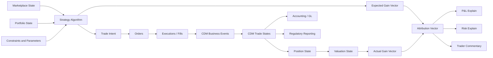

# CDM-Native Trade Continuum Algebra

**Strategy document**
**Date:** 2026-07-03
**Working name:** CDM-native Strategy-to-P&L Algebra
**Alternative names:** Trade Continuum Algebra, Canonical Trade Algebra, Strategy Gain Vector Layer

---

## 1. Executive Summary

This document proposes a **single trade algebra** that represents the full continuum from marketplace observation to strategy execution, CDM trade formation, lifecycle events, position/risk generation, actual gain measurement, and P&L explanation.

The central idea is:

> A trade strategy is an executable algorithm applied to marketplace state. It produces trade intent and an expected gain vector. That intent is materialized through orders, executions, and CDM-compatible trade lifecycle events. The resulting trade and position states are later measured as an actual gain vector. P&L, risk, accounting, regulatory reporting, and trader commentary are projections over this same continuum.

The model treats **CDM as the canonical contract and lifecycle spine**, not as the entire universe. Strategy, execution, gain vectors, attribution, market state, and P&L explanation are modeled as **CDM-compatible extensions** around that spine.

The goal is not merely to map between systems. The goal is to create a **semantic layer** where the meaning of a trade is preserved from intent through execution to realized economic outcome.

---

## 2. Core Thesis

Most trading architectures split the world into disconnected systems:

```text
strategy system -> order system -> trade capture -> risk -> P&L -> accounting -> reporting
```

Each handoff loses semantic information. The trade may survive, but the reason the trade exists, the expected gain vector, the algorithmic decision, and the relationship between intent and outcome are often weakened or lost.

The proposed model replaces that with a single continuum:

```text
marketplace state
  -> strategy algorithm
  -> expected gain vector
  -> trade intent
  -> order / execution
  -> CDM business event
  -> CDM trade state
  -> lifecycle events
  -> position state
  -> valuation state
  -> actual gain vector
  -> P&L / risk / GL / regulatory / commentary projections
```

The algebraic claim is:

> A trading system should be modeled as a causal composition of typed transformations from market observation to realized gain.

---

## 3. Why CDM Is the Right Spine

CDM already gives a standard structure for representing financial products, trades, legal/economic terms, lifecycle events, and related processes. It is therefore the natural center of gravity for the contractual and lifecycle portion of the algebra.

However, CDM should not be forced to represent everything directly. In particular, a trading strategy is not simply a product, a trade, or a lifecycle event. A strategy is an **algorithmic operator** that acts on marketplace state and portfolio state.

Therefore:

```text
CDM = canonical contract and lifecycle spine
Strategy extension = pre-trade and intent layer
Gain vector extension = economic intent and outcome layer
Projection layer = risk, P&L, GL, reg, commentary, system surfaces
```

The design principle is:

> Extend CDM without corrupting CDM. Preserve CDM conformance while adding the missing semantic layer above and around it.

---

## 4. The Main Conceptual Move

A trade is not only an isolated legal/economic contract.

A trade is a realized segment of a broader marketplace transformation:

```text
StrategyAlgorithm applied to MarketplaceState
  produces ExpectedGainVector and TradeIntent
  which becomes Orders and Executions
  which lift into CDM BusinessEvents
  which produce TradeStates and PositionStates
  which are observed as ActualGainVector
  which projects into P&L, risk, accounting, reporting, and explanation.
```

This means a trade strategy should not be represented merely by a desk code, book code, or strategy label attached to a trade.

Instead, strategy should be a first-class object:

```text
StrategyAlgorithm :
  MarketplaceState × PortfolioState × Constraints × Parameters
    -> TradeIntent × ExpectedGainVector
```

The resulting trade is the materialized contractual artifact. The gain vector is the semantic signature of what the strategy was trying to extract from the marketplace.

---

## 5. Strategic Objective

Build a **CDM-compatible strategy extension** capable of representing:

1. The algorithm being applied to the marketplace.
2. The market and portfolio state observed by that algorithm.
3. The expected gain vector defined at decision time.
4. The trade intent generated by the algorithm.
5. The orders and executions that materialize the intent.
6. The CDM business events and trade states that result.
7. The actual gain vector measured after execution and market evolution.
8. The attribution between expected gain, executed exposure, actual gain, and realized P&L.
9. The downstream projections into P&L, risk, accounting, reporting, and commentary.

This allows the organization to preserve semantic causality across the full trade lifecycle.

---

## 6. Trade Continuum Algebra

Define the trade continuum algebra as:

```text
𝕋 = (
  MarketplaceState,
  PortfolioState,
  StrategyAlgorithm,
  Constraints,
  Parameters,
  TradeIntent,
  OrderSet,
  ExecutionSet,
  CDMBusinessEvent,
  CDMTradeState,
  PositionState,
  ValuationState,
  GainVector,
  AttributionVector,
  Projection,
  Lineage
)
```

The key operation is a typed transition:

```text
Transition[A, B] =
  inputState: A
  operator: Operator
  outputState: B
  evidence: Lineage
  projections: Projection[]
```

Everything in the continuum is modeled as a transition:

```text
StrategyRun      : Transition[MarketplaceState, TradeIntent]
Execution        : Transition[TradeIntent, ExecutionSet]
TradeFormation   : Transition[ExecutionSet, CDMTradeState]
LifecycleEvent   : Transition[CDMTradeState, CDMTradeState]
PositionRollup   : Transition[CDMTradeState[], PositionState]
Valuation        : Transition[PositionState, ValuationState]
GainObservation  : Transition[ValuationState, GainVector]
PnLProjection    : Transition[GainVector, PnLExplain]
```

Composition gives the full lifecycle:

```text
PnLExplain =
  π_pnl
  ∘ ObserveGain
  ∘ Value
  ∘ AggregatePositions
  ∘ ApplyLifecycleEvents
  ∘ LiftExecutionToCDM
  ∘ ExecuteOrders
  ∘ GenerateIntent
  ∘ ApplyStrategy
  (MarketplaceState)
```

This is the mathematical heart of the model.

---

## 7. Strategy as Algorithm

A trade strategy is a particular algorithm applied to the marketplace.

It is not merely:

```text
a portfolio grouping
```

and not merely:

```text
a label on a trade
```

It is:

```text
StrategyAlgorithm :
  MarketplaceState × PortfolioState × Constraints × Parameters
    -> StrategyDecision
```

Where:

```text
StrategyDecision =
  TradeIntent
  + ExpectedGainVector
  + ExecutionPreference
  + Confidence
  + Rationale
  + ModelReference
```

A strategy has two important forms:

```text
StrategyDefinition = reusable algorithmic template
StrategyRun        = one invocation of that algorithm in a specific marketplace state
```

The `StrategyRun` is the central causal object.

---

## 8. StrategyDefinition

A `StrategyDefinition` represents a reusable trading algorithm or policy.

```text
StrategyDefinition
  strategyId
  strategyName
  strategyType
  algorithmReference
  algorithmVersion
  ownerDesk
  applicableMarkets
  tradableUniverse
  decisionFrequency
  inputRequirements
  parameterSchema
  constraints
  gainVectorBasis
  governanceStatus
```

Examples of `strategyType`:

```text
outright_directional
calendar_spread
basis_trade
relative_value
statistical_arbitrage
market_making
inventory_optimization
volatility_strategy
convexity_strategy
hedging_strategy
carry_strategy
liquidity_strategy
physical_optionalilty
```

The strategy definition answers:

> What algorithm is this, where can it operate, and what kind of gain vector does it seek?

---

## 9. StrategyRun

A `StrategyRun` represents one application of a strategy algorithm to a particular marketplace state.

```text
StrategyRun
  runId
  strategyDefinition
  algorithmVersion
  runTimestamp
  marketplaceStateReference
  portfolioStateReference
  parameterSet
  constraints
  signalInputs
  expectedGainVector
  generatedTradeIntents
  generatedOrders
  generatedExecutions
  generatedCDMBusinessEvents
  resultingCDMTradeStates
  resultingPositionState
  actualGainVector
  attributionVector
  lineage
```

The `StrategyRun` preserves the causal chain:

```text
market observation
  caused strategy decision
  caused expected gain vector
  caused trade intent
  caused order
  caused execution
  caused CDM business event
  caused trade state
  caused position state
  caused actual gain vector
  caused P&L explanation
```

This object is the bridge between algorithmic trading systems and post-trade CDM representation.

---

## 10. Gain Vectors

A gain vector is the structured representation of the economic transformation expected or realized by a strategy.

It is richer than P&L.

P&L is usually a scalar projection:

```text
π_pnl : GainVector -> Money
```

The gain vector itself may include dimensions such as:

```text
flat price
curve exposure
basis exposure
spread exposure
volatility
skew
convexity
carry
FX
funding
credit
liquidity
inventory
delivery optionality
location basis
grade / quality basis
carbon / emissions
model residual
execution slippage
```

The model distinguishes at least four vectors:

```text
ExpectedGainVector  = expected economic transformation at decision time
ExecutedGainVector  = exposure actually obtained through execution
ActualGainVector    = realized economic transformation after market evolution
AttributionVector   = explanation of difference between expected, executed, and actual
```

This gives a precise explanation framework:

```text
ExpectedGainVector
  vs ExecutedGainVector
  vs ActualGainVector
  -> AttributionVector
  -> P&L Explain
```

---

## 11. Typed Gain Vector Bases

There should not be one flat universal vector basis. Different domains require different bases.

Recommended basis types:

```text
MarketFeatureBasis
RiskFactorBasis
ContractEconomicBasis
CommodityPhysicalBasis
ExecutionQualityBasis
AccountingBasis
RegulatoryBasis
AttributionBasis
```

A gain vector should always be typed:

```text
GainVector<Basis>
```

Examples:

```text
GainVector<RiskFactorBasis>
GainVector<CommodityPhysicalBasis>
GainVector<ExecutionQualityBasis>
GainVector<AttributionBasis>
```

Projection functions translate between bases or surfaces:

```text
π_pnl      : GainVector<RiskFactorBasis> -> Money
π_comment  : GainVector<AttributionBasis> -> NaturalLanguageExplain
π_risk     : PositionState -> RiskReport
π_reg      : CDMTradeState -> RegulatoryReport
π_gl       : CashflowEvent -> LedgerPosting
π_fix      : OrderEvent -> FIXMessage
π_cdm      : ExecutionSet -> CDMBusinessEvent
```

This prevents the model from confusing economic intent, risk exposure, accounting representation, and regulatory representation.

---

## 12. GainComponent

A gain vector is composed of gain components.

```text
GainComponent
  componentId
  basis
  dimension
  underlier
  tenor
  location
  direction
  magnitude
  unit
  sensitivityMeasure
  expectedContribution
  executedContribution
  actualContribution
  attributionMethod
  confidence
  explanation
```

Example commodity components:

```text
- long Brent flat price, Jun-2027 tenor
- long Brent-Dubai basis
- long front-month backwardation
- long storage optionality
- short USD funding exposure
- exposed to delivery-location basis risk
```

Example equity components:

```text
- long single-name delta
- market beta neutralized
- long sector exposure
- long dividend income
- short borrow cost
```

Example derivative components:

```text
- delta neutral
- long gamma
- long vega
- short theta
- long put skew
- exposed to model residual
```

---

## 13. Relationship to CDM

The proposed model should be CDM-native but not CDM-limited.

CDM should represent:

```text
product economics
trade state
business events
legal/economic lifecycle
settlement terms
contractual obligations
```

The strategy extension should represent:

```text
algorithmic intent
marketplace state reference
portfolio state reference
expected gain vector
trade intent
execution decision
strategy lineage
actual gain vector
attribution
```

The clean relationship is:

```text
StrategyRun
  -> TradeIntent
  -> Order / Execution
  -> CDM BusinessEvent
  -> CDM TradeState
  -> PositionState
  -> ActualGainVector
```

The CDM trade remains the canonical representation of the contract. The strategy extension explains why the trade exists and what economic transformation it was intended to produce.

---

## 14. Do Not Treat Strategy as a Trade

A key design rule:

```text
Strategy ≠ Trade
Strategy ≠ Product
Strategy ≠ Book code
Strategy ≠ P&L bucket
```

Instead:

```text
Strategy = algorithmic operator over marketplace and portfolio state
Trade    = contractual/economic artifact generated or selected by the strategy
Gain     = observed economic transformation
P&L      = scalar money projection of gain
```

This avoids contaminating the CDM product model with non-contractual concepts.

---

## 15. CDM-Compatible Extension Packages

Suggested extension namespaces:

```text
cdm.extension.strategy
cdm.extension.strategy.algorithm
cdm.extension.strategy.marketplace
cdm.extension.strategy.intent
cdm.extension.strategy.execution
cdm.extension.strategy.gain
cdm.extension.strategy.attribution
cdm.extension.strategy.projection
cdm.extension.strategy.commodity
cdm.extension.strategy.equity
cdm.extension.strategy.derivative
```

These extensions should reference CDM objects rather than duplicating them.

For example:

```text
StrategyRun
  references:
    CDMTradeState[]
    CDMBusinessEvent[]
    TradableProduct[]
    Party[]
    Observable[]
    LegalAgreement[]
    SettlementTerms[]
```

The extension should remain an overlay that preserves CDM conformance.

---

## 16. Projection Model

Every downstream artifact should be represented as a projection from the continuum.

```text
π_fix      : TradeIntent / Order / Execution -> FIX surface
π_cdm      : ExecutionSet -> CDM BusinessEvent
π_fpml     : CDMTradeState -> FpML confirmation view
π_risk     : PositionState -> Risk report
π_pnl      : GainVector -> P&L explain
π_gl       : CashflowEvent -> Ledger posting
π_reg      : CDMTradeState -> Regulatory report
π_comment  : AttributionVector -> Trader commentary
π_ui       : ContinuumState -> Trader / ops screen
```

Projection quality should be explicit:

```text
Lossless projection:
  enough information to reconstruct the relevant canonical state

Lossy projection:
  useful for a specific purpose but cannot reconstruct the full state

Invalid projection:
  changes or misrepresents the economic meaning
```

The discipline is:

> A projection may be incomplete, but it must not be dishonest.

---

## 17. Invariants

The algebra should enforce invariants across the continuum.

### 17.1 Causal Lineage Invariant

Every downstream report or explanation should be traceable back to:

```text
strategy definition
strategy run
marketplace state
portfolio state
expected gain vector
trade intent
execution
CDM business event
CDM trade state
valuation basis
actual gain vector
projection contract
```

### 17.2 CDM Integrity Invariant

Strategy extensions must not mutate the economic meaning of a CDM trade.

```text
A Strategy may explain, group, target, transform, or generate trades,
but it must not alter the contractual meaning of the CDM trade state.
```

### 17.3 Gain Vector Basis Invariant

Every gain vector must declare its basis.

```text
GainVector without Basis = invalid
```

### 17.4 Projection Fidelity Invariant

Every projection must declare whether it is lossless, lossy, or invalid for reconstruction.

### 17.5 P&L Explanation Invariant

No P&L explanation should exist without a link to:

```text
actual gain vector
valuation state
market move
lifecycle events
cashflows
model changes
execution slippage
residual attribution
```

---

## 18. Multi-Grain Time Model

Real trading systems operate across multiple temporal grains.

```text
nanoseconds / milliseconds:
  market data, order book, signals

seconds / minutes:
  parent orders, child orders, fills, execution tactics

minutes / days:
  bookings, confirmations, allocations, clearing

days / months / years:
  resets, fixings, settlements, expiries, lifecycle events

daily / monthly:
  risk, P&L, accounting, regulatory reporting
```

The continuum algebra must not flatten these grains. Instead, it should connect them through typed transitions and references.

The pre-trade layer may operate at market-data speed. The CDM layer operates at trade/lifecycle speed. The risk/P&L layer may operate at valuation-cycle speed.

They are different grains of the same causal continuum.

---

## 19. Asset-Class Coverage

### 19.1 Commodities

Commodities require physical and logistical semantics beyond standard financial product representation.

Important extensions:

```text
commodity
quality / grade
location
delivery window
incoterms
transport
storage
nominations
volume tolerance
index pricing
basis
imbalance
outage / force majeure
carbon / emissions
```

Commodity gain vectors may include:

```text
flat price
calendar spread
location basis
grade basis
storage optionality
transport optionality
inventory optionality
weather / outage exposure
FX and funding
```

### 19.2 Equities

Equity strategies require securities, corporate actions, borrow, funding, and basket/index semantics.

Important extensions:

```text
single-name exposure
index / basket exposure
sector exposure
corporate actions
dividends
borrow / locate
settlement cycle
stock loan
short exposure
beta neutralization
```

Equity gain vectors may include:

```text
delta
market beta
sector beta
factor exposure
dividend carry
borrow cost
corporate action exposure
liquidity exposure
```

### 19.3 Derivatives

Derivative strategies require payoff, optionality, observation, volatility, and model semantics.

Important extensions:

```text
payoff graph
exercise logic
observation schedule
reset / fixing logic
collateral / margin
valuation model
risk factor mapping
scenario set
Greeks
```

Derivative gain vectors may include:

```text
delta
gamma
vega
theta
rho
skew
convexity
correlation
basis
model residual
```

---

## 20. Example: Commodity Basis Strategy

### 20.1 Strategy Definition

```yaml
StrategyDefinition:
  strategyId: STRAT-COMM-BASIS-001
  strategyName: Brent Dubai Basis Widening
  strategyType: basis_trade
  ownerDesk: Global Oil
  applicableMarkets:
    - Brent
    - Dubai
  decisionFrequency: daily
  gainVectorBasis: CommodityStrategyFactorBasis
  algorithmReference:
    name: basis_signal_model
    version: 1.4.2
```

### 20.2 Strategy Run

```yaml
StrategyRun:
  runId: RUN-2026-07-03-001
  strategyDefinition: STRAT-COMM-BASIS-001
  runTimestamp: 2026-07-03T15:30:00-07:00
  marketplaceStateReference: MKT-SNAPSHOT-2026-07-03-1530
  portfolioStateReference: PORT-OIL-BOOK-1530
  expectedGainVector:
    basis: CommodityStrategyFactorBasis
    horizon: 30D
    components:
      - dimension: brent_dubai_basis
        direction: long_spread
        magnitude: 0.85
        unit: USD/bbl
      - dimension: flat_price
        underlier: Brent
        direction: neutralized
      - dimension: calendar_spread
        underlier: Brent
        direction: long_front_short_back
      - dimension: funding
        direction: short_carry
  generatedTradeIntents:
    - intentId: INTENT-001
      action: enter_spread
      targetExposure: long_brent_short_dubai
```

### 20.3 Outcome

```yaml
ActualGainVector:
  basis: CommodityStrategyFactorBasis
  horizon: 30D
  components:
    - dimension: brent_dubai_basis
      expectedContribution: 0.85
      actualContribution: 0.62
      unit: USD/bbl
    - dimension: execution_slippage
      actualContribution: -0.07
      unit: USD/bbl
    - dimension: funding
      actualContribution: -0.03
      unit: USD/bbl
    - dimension: residual
      actualContribution: -0.02
      unit: USD/bbl
```

The P&L explanation is a projection:

```text
π_pnl(ActualGainVector) -> Money P&L
```

The trader commentary is another projection:

```text
π_comment(AttributionVector) -> Narrative Explain
```

---

## 21. Example: Derivative Volatility Strategy

```yaml
StrategyDefinition:
  strategyId: STRAT-EQ-VOL-002
  strategyName: Long Event Convexity
  strategyType: volatility_strategy
  ownerDesk: Equity Derivatives
  gainVectorBasis: DerivativeRiskFactorBasis

StrategyRun:
  runId: RUN-2026-07-03-002
  expectedGainVector:
    basis: DerivativeRiskFactorBasis
    horizon: 10D
    components:
      - dimension: delta
        direction: neutral
      - dimension: gamma
        direction: long
      - dimension: vega
        direction: long
      - dimension: theta
        direction: short
      - dimension: skew
        direction: long_put_skew
  generatedTradeIntents:
    - action: buy_option_structure
      underlier: EQUITY-XYZ
      target: long_gamma_long_vega
```

Outcome attribution:

```yaml
AttributionVector:
  components:
    - dimension: realized_volatility
      contribution: positive
    - dimension: implied_volatility_move
      contribution: negative
    - dimension: theta_decay
      contribution: negative
    - dimension: delta_hedging
      contribution: positive
    - dimension: execution_slippage
      contribution: negative
```

---

## 22. Minimal Object Model

The first version of the model should focus on a small but expressive set of objects.

```text
StrategyDefinition
StrategyRun
MarketplaceStateReference
PortfolioStateReference
TradeIntent
ExecutionReference
CDMBusinessEventReference
CDMTradeStateReference
GainVectorBasis
GainVector
GainComponent
AttributionVector
ProjectionContract
LineageReference
```

This keeps the first implementation achievable while preserving the full conceptual shape.

---

## 23. Minimal Pseudo-Type Definitions

```text
type StrategyDefinition:
  strategyId string
  strategyName string
  strategyType StrategyType
  algorithmReference AlgorithmReference
  ownerDesk string
  applicableMarkets MarketIdentifier[]
  tradableUniverse TradableProduct[]
  parameterSchema ParameterSchema
  constraints StrategyConstraint[]
  gainVectorBasis GainVectorBasis

type StrategyRun:
  runId string
  strategyDefinition StrategyDefinition
  runTimestamp datetime
  marketplaceStateReference MarketplaceStateReference
  portfolioStateReference PortfolioStateReference
  parameterSet ParameterSet
  expectedGainVector GainVector
  generatedTradeIntents TradeIntent[]
  generatedExecutionReferences ExecutionReference[]
  generatedBusinessEvents CDMBusinessEventReference[]
  resultingTradeStates CDMTradeStateReference[]
  actualGainVector GainVector optional
  attributionVector AttributionVector optional
  lineage LineageReference

type GainVector:
  vectorId string
  basis GainVectorBasis
  horizon Horizon
  valuationTime datetime
  components GainComponent[]
  confidence ConfidenceMeasure optional
  scenarioSet ScenarioSetReference optional
  modelReference ModelReference optional
  explanation string optional

type GainComponent:
  componentId string
  dimension string
  underlier Observable optional
  tenor Tenor optional
  location Location optional
  direction Direction
  magnitude number optional
  unit Unit optional
  sensitivityMeasure string optional
  expectedContribution number optional
  executedContribution number optional
  actualContribution number optional
  attributionMethod string optional
```

---

## 24. Implementation Architecture

Recommended architectural layers:

```text
1. Pre-trade strategy layer
   - market state capture
   - signal generation
   - strategy algorithm invocation
   - expected gain vector generation

2. Execution layer
   - trade intent
   - parent orders
   - child orders
   - fills
   - execution quality

3. CDM lift layer
   - map executions/fills into CDM business events
   - create or update CDM trade states
   - preserve references to StrategyRun

4. Position and valuation layer
   - aggregate trade states into positions
   - apply curves, surfaces, market data, models
   - generate valuation states

5. Gain observation and attribution layer
   - compute actual gain vector
   - compare expected vs executed vs actual
   - generate attribution vector

6. Projection layer
   - P&L explain
   - risk reports
   - GL postings
   - regulatory reports
   - commentary
   - UI views
```

The architecture should be event-sourced where possible. The current state should be reproducible from the sequence of transitions and their lineage.

---

## 25. Roadmap

### Phase 0 — Thesis and Boundary Definition

Deliverables:

```text
- Finalize terminology
- Define continuum scope
- Decide which CDM objects will be referenced directly
- Decide extension namespace strategy
- Define first asset-class use case
```

Recommended first use case:

```text
commodity basis trade or derivative volatility strategy
```

These are rich enough to prove the gain-vector idea but bounded enough to implement.

### Phase 1 — Minimal Strategy Extension

Deliverables:

```text
- StrategyDefinition schema
- StrategyRun schema
- GainVector schema
- GainComponent schema
- CDM reference model
- basic lineage model
```

Success criterion:

```text
A StrategyRun can reference CDM trade states and explain the expected gain vector that produced them.
```

### Phase 2 — Execution and CDM Lift

Deliverables:

```text
- TradeIntent schema
- ExecutionReference schema
- mapping from fills/executions to CDM BusinessEvent references
- projection contract for CDM lift
```

Success criterion:

```text
An execution can be traced from StrategyRun to CDM BusinessEvent to resulting CDM TradeState.
```

### Phase 3 — Actual Gain and Attribution

Deliverables:

```text
- ActualGainVector computation
- Expected vs actual comparison
- AttributionVector schema
- residual handling
```

Success criterion:

```text
The model can explain why actual gain differed from expected gain.
```

### Phase 4 — P&L Projection

Deliverables:

```text
- P&L projection function
- risk factor attribution
- trader commentary projection
- reconciliation against existing P&L explain
```

Success criterion:

```text
P&L explanation is generated as a projection from the actual gain vector and attribution vector.
```

### Phase 5 — Governance and Industrialization

Deliverables:

```text
- versioned strategy definitions
- model/version lineage
- projection fidelity declarations
- controls and validation rules
- conformance tests
- audit views
```

Success criterion:

```text
The continuum can be audited from report back to strategy decision and marketplace state.
```

---

## 26. Primary Use Cases

### 26.1 Strategy-Aware Trade Capture

Capture not only what was traded, but why it was traded.

```text
CDM TradeState + StrategyRun reference + ExpectedGainVector
```

### 26.2 P&L Explanation

Explain P&L as the realized projection of an actual gain vector.

```text
P&L = π_pnl(ActualGainVector)
```

### 26.3 Execution Quality

Compare intended gain to executed exposure.

```text
ExpectedGainVector - ExecutedGainVector = execution shortfall / slippage / exposure mismatch
```

### 26.4 Strategy Performance

Evaluate strategies by comparing expected, executed, and actual gain vectors across many runs.

### 26.5 Risk Explainability

Tie risk exposures back to the strategies that generated them.

### 26.6 Regulatory and Audit Traceability

Trace a reportable trade or risk number back through:

```text
report -> projection -> gain vector -> trade state -> CDM event -> execution -> strategy run -> market state
```

---

## 27. Differentiation from Existing Architectures

Typical architecture:

```text
systems are primary
trade semantics are fragmented
strategy intent disappears after booking
P&L is reconstructed after the fact
```

Proposed architecture:

```text
semantic continuum is primary
systems are projections
strategy intent is first-class
P&L is a projection of actual gain and attribution
```

This is not just a schema project. It is a shift from trade capture to trade meaning capture.

---

## 28. Design Warnings

### 28.1 Do Not Overload CDM

Do not make CDM carry every pre-trade or strategy concept directly.

Use CDM as the spine. Add strategy and gain-vector semantics as extensions.

### 28.2 Do Not Flatten Gain Vectors

A single flat vector will become ambiguous. Always declare the basis.

### 28.3 Do Not Confuse P&L with Gain

P&L is only one projection of the actual gain vector.

### 28.4 Do Not Lose Lineage

The model is only valuable if every transition preserves lineage.

### 28.5 Do Not Treat Strategy as Metadata

Strategy is not a label. Strategy is the applied algorithm.

---

## 29. Governance Model

The model should support governance over:

```text
strategy definitions
algorithm versions
parameter sets
marketplace state snapshots
model references
gain vector basis definitions
projection functions
CDM lift mappings
valuation models
attribution methods
commentary generation rules
```

Every material object should be versioned or reference a versioned object.

The audit question should always be answerable:

> Given this P&L number, which strategy run, trade state, market data, valuation basis, and gain vector produced it?

---

## 30. North Star Architecture



---

## 31. One-Sentence Positioning

> A CDM-native Trade Continuum Algebra captures the full causal chain from marketplace state to strategy algorithm, expected gain vector, trade intent, execution, CDM lifecycle state, actual gain vector, and downstream P&L, risk, accounting, regulatory, and commentary projections.

---

## 32. Short Product Positioning

This is not a CDM mapper.

This is a **semantic trade continuum layer**.

It makes strategy intent, execution, trade state, gain, and P&L part of the same causal object.

It allows firms to answer:

```text
Why does this trade exist?
What gain vector was expected?
What was actually executed?
What CDM trade state resulted?
What gain vector was realized?
How did that become P&L, risk, accounting, and reporting?
```

---

## 33. Final Formulation

The final formulation is:

> A trade strategy is an executable algorithm over marketplace state. Its expected gain vector defines the intended economic transformation. Its generated intents, orders, and executions lift into CDM business events. Those events produce trade and position states. The actual gain vector measures the realized transformation. P&L, risk, accounting, regulatory reporting, and commentary are typed projections over that single continuum.

This is the essence of the proposed trade algebra.
