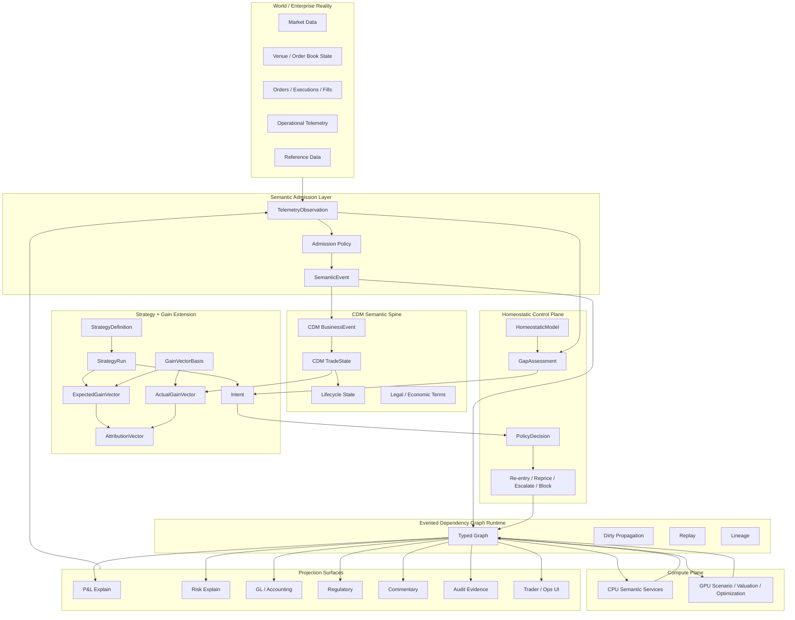
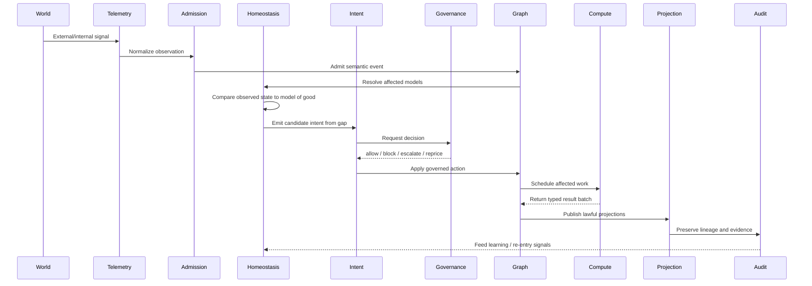
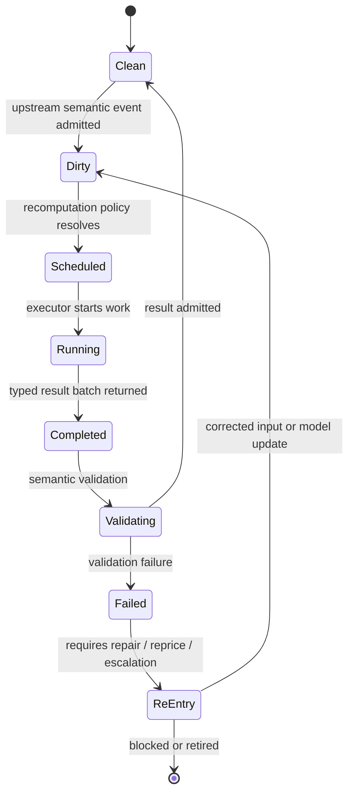
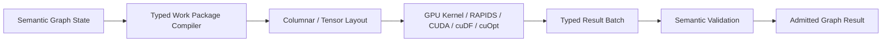

# Homeostatic Trade Continuum Architecture

## 1. Executive thesis

This architecture treats a trading platform as a **homeostatic financial organism**.

It maintains an internal model of what “good” looks like, observes internal and external reality through telemetry, computes the gap between the model and reality, and generates intent as directed pressure to reduce, exploit, or reprice that gap.

The core claim is:

> Meaningful agency is homeostatic regulation over a model of the good.

In financial systems, this becomes:

> A strategy is a homeostatic regulator. It observes marketplace and portfolio state, evaluates a gap against a governed model of good, emits intent and expected gain vector, materializes through execution and CDM lifecycle events, and later compares actual gain against expected gain through replayable attribution.

This is not merely a trading system, risk engine, data platform, or reporting layer.

It is a **CDM-native, event-sourced, typed semantic continuum** over which P&L, risk, accounting, regulatory reporting, commentary, audit, and strategy performance are projections.

---

## 2. Architectural north star

The target continuum is:

```text
MarketplaceState
  -> StrategyAlgorithm
  -> ExpectedGainVector
  -> TradeIntent
  -> Order / Execution
  -> CDM BusinessEvent
  -> CDM TradeState
  -> LifecycleEvent
  -> PositionState
  -> ValuationState
  -> ActualGainVector
  -> AttributionVector
  -> P&L / Risk / GL / Regulatory / Commentary / Audit projections
```

The homeostatic control loop around that continuum is:

```text
HomeostaticModel
  -> Observe(WorldState)
  -> ComputeGap(ModelState, ObservedState)
  -> GenerateIntent(Gap)
  -> SelectAction(Intent)
  -> ApplyAction(World)
  -> Observe(WorldState')
  -> Learn / Reprice / Re-enter
```

Combined:

```text
World telemetry
  -> semantic admission
  -> model-of-good comparison
  -> gap assessment
  -> intent proposal
  -> governed action
  -> CDM lifecycle materialization
  -> valuation / gain / attribution
  -> projection surfaces
  -> audit / learning / re-entry
```

---

## 3. Design principles

### 3.1 CDM is the semantic spine, not the whole organism

CDM represents what the trade is:

- legal and economic terms
- product structure
- trade state
- business events
- lifecycle state
- contractual obligations

The platform-specific extensions represent why the trade exists and how it behaves as part of a strategy:

- strategy definition
- strategy run
- homeostatic model
- intent
- expected gain vector
- actual gain vector
- attribution vector
- projection contracts

Design invariant:

```text
CDM = trade/lifecycle truth
Strategy/Gain/Homeostasis = explanatory and regulatory extension layer
Projection = consumer-specific view over the continuum
```

### 3.2 Intent is first-class

Intent is not a label, comment, desk code, or order note.

Intent is a runtime object generated by a gap between:

```text
model of good
    and
observed reality
```

Examples:

- trade intent
- hedge intent
- rebalance intent
- reprice intent
- investigate intent
- block intent
- repair-lineage intent
- escalate intent
- update-model intent

### 3.3 Gain is richer than P&L

P&L is a projection. Gain is the richer transformation space.

A gain vector may contain:

- price movement
- curve movement
- basis movement
- vol movement
- carry
- funding
- FX
- execution quality
- hedge effectiveness
- liquidity cost
- model residual
- operational cost
- capital/risk consumption

Invariant:

```text
No GainVector without a declared GainVectorBasis.
```

### 3.4 Telemetry is not truth

Telemetry is observed.

Truth is admitted, typed, versioned, governed, and replayable.

```text
provider event
  -> telemetry observation
  -> admission decision
  -> semantic event
  -> graph state
```

### 3.5 Compute must not erase meaning

GPU arrays and numerical kernels are not the model.

They are accelerated representations of typed semantic work packages.

```text
semantic state
  -> typed work package
  -> columnar/tensor layout
  -> GPU computation
  -> typed result batch
  -> admitted semantic result
```

### 3.6 Projections may be lossy, but not dishonest

A projection must declare:

- source state
- basis
- transform
- fidelity
- lossiness
- validation rules
- version
- lineage

---

## 4. Domain model overview



---

## 5. Core runtime loop



Pseudo-code:

```ts
function onTelemetryAdmitted(event: SemanticEvent): RuntimeEffects {
  const observation = normalizeObservation(event);
  const affectedModels = resolveHomeostaticModels(observation);

  const effects: RuntimeEffects = [];

  for (const model of affectedModels) {
    const gap = evaluateGap(model, observation);

    if (!gap.material) {
      effects.push(recordNoOp(gap));
      continue;
    }

    const intent = generateIntent(gap);
    const decision = governIntent(intent);

    switch (decision.kind) {
      case "allow":
        effects.push(applyIntent(intent));
        break;

      case "block":
        effects.push(publishBlock(intent, decision.reason));
        break;

      case "escalate":
        effects.push(requestAuthority(intent, decision.requiredAuthority));
        break;

      case "reprice":
        effects.push(createReentryPlan(intent, decision.target));
        break;
    }
  }

  effects.push(recomputeAffectedGraph(event));
  effects.push(publishUpdatedProjections(event));

  return effects;
}
```

---

## 6. Object schemas

The following TypeScript-style schemas define the first implementation shape. They are intended as architecture-level contracts, not final generated code.

### 6.1 Identity and lineage primitives

```ts
type Id<T extends string> = string & { readonly __brand: T };

type Instant = string; // ISO-8601
type Version = string;
type Currency = string;
type DecimalString = string;

interface LineageRef {
  lineageId: Id<"Lineage">;
  sourceEventIds: Id<"SemanticEvent">[];
  inputNodeIds: Id<"GraphNode">[];
  modelVersions: Record<string, Version>;
  dataVersions: Record<string, Version>;
  generatedBy: {
    service: string;
    functionRef: string;
    codeVersion: Version;
    runId: Id<"Run">;
  };
  observedAt: Instant;
  admittedAt: Instant;
}
```

### 6.2 Semantic event

```ts
type SemanticEventKind =
  | "market_data_observed"
  | "reference_data_observed"
  | "strategy_defined"
  | "strategy_run_started"
  | "gap_assessed"
  | "intent_proposed"
  | "intent_governed"
  | "order_submitted"
  | "execution_observed"
  | "cdm_business_event_created"
  | "cdm_trade_state_updated"
  | "valuation_completed"
  | "gain_vector_observed"
  | "attribution_completed"
  | "projection_published"
  | "control_breached"
  | "reentry_requested"
  | "model_update_proposed";

interface SemanticEvent<TPayload = unknown> {
  id: Id<"SemanticEvent">;
  kind: SemanticEventKind;
  aggregateId: string;
  payload: TPayload;
  eventTime: Instant;
  admittedTime: Instant;
  source: {
    system: string;
    feed?: string;
    messageId?: string;
  };
  schemaVersion: Version;
  lineage?: LineageRef;
}
```

### 6.3 Telemetry observation

```ts
type TelemetryDomain =
  | "market"
  | "venue"
  | "portfolio"
  | "execution"
  | "cdm_lifecycle"
  | "valuation"
  | "risk"
  | "pnl"
  | "operations"
  | "data_quality"
  | "model_risk"
  | "governance";

interface TelemetryObservation<T = unknown> {
  id: Id<"TelemetryObservation">;
  domain: TelemetryDomain;
  observedState: T;
  observedAt: Instant;
  quality: {
    completeness: number;
    freshnessMs: number;
    confidence: number;
    sourceReliability: number;
  };
  sourceEventId: Id<"SemanticEvent">;
  lineage: LineageRef;
}
```

### 6.4 Homeostatic model

```ts
type ConstraintClass =
  | "economic"
  | "risk"
  | "capital"
  | "liquidity"
  | "regulatory"
  | "model_risk"
  | "operational"
  | "data_quality"
  | "semantic_integrity"
  | "lineage";

type ConstraintSeverity = "info" | "warning" | "breach" | "critical";

interface ViabilityConstraint<TState = unknown> {
  id: Id<"ViabilityConstraint">;
  name: string;
  class: ConstraintClass;
  description: string;
  appliesTo: string[];
  evaluatorRef: string;
  expectedState?: TState;
  tolerance?: {
    lower?: DecimalString;
    upper?: DecimalString;
    unit?: string;
  };
  severity: ConstraintSeverity;
  authorityRequired?: string;
  version: Version;
}

interface HomeostaticModel {
  id: Id<"HomeostaticModel">;
  name: string;
  scope: {
    desk?: string;
    book?: string;
    strategy?: Id<"StrategyDefinition">;
    assetClass?: string;
    jurisdiction?: string;
  };
  viabilityConstraints: ViabilityConstraint[];
  objectiveHints?: ObjectiveHint[];
  policyRefs: Id<"PolicyRule">[];
  modelOwner: string;
  effectiveFrom: Instant;
  effectiveTo?: Instant;
  version: Version;
}

interface ObjectiveHint {
  name: string;
  direction: "maximize" | "minimize" | "maintain" | "avoid";
  measure: string;
  weight?: DecimalString;
}
```

### 6.5 Gap assessment

```ts
type GapType =
  | "economic_gap"
  | "risk_gap"
  | "execution_gap"
  | "valuation_gap"
  | "lineage_gap"
  | "data_quality_gap"
  | "semantic_gap"
  | "operational_gap"
  | "governance_gap"
  | "model_gap"
  | "requirement_gap";

interface GapComponent {
  constraintId: Id<"ViabilityConstraint">;
  type: GapType;
  measure: string;
  expected?: DecimalString;
  actual?: DecimalString;
  delta?: DecimalString;
  unit?: string;
  severity: ConstraintSeverity;
  confidence: number;
  explanation: string;
}

interface GapAssessment {
  id: Id<"GapAssessment">;
  modelId: Id<"HomeostaticModel">;
  observationIds: Id<"TelemetryObservation">[];
  components: GapComponent[];
  material: boolean;
  aggregateSeverity: ConstraintSeverity;
  candidateIntentTypes: IntentType[];
  lineage: LineageRef;
  assessedAt: Instant;
}
```

### 6.6 Intent

```ts
type IntentType =
  | "trade"
  | "hedge"
  | "rebalance"
  | "reprice"
  | "investigate"
  | "block"
  | "escalate"
  | "repair_lineage"
  | "refresh_market_data"
  | "update_model"
  | "regenerate_projection"
  | "rerun_valuation";

type IntentStatus =
  | "proposed"
  | "allowed"
  | "blocked"
  | "escalated"
  | "executed"
  | "superseded"
  | "cancelled";

interface IntentProposal {
  id: Id<"Intent">;
  type: IntentType;
  generatedFromGapId: Id<"GapAssessment">;
  targetStateDescription: string;
  expectedEffect: {
    gainVectorDelta?: Id<"GainVector">;
    riskDelta?: Record<string, DecimalString>;
    controlImpact?: string;
  };
  affectedNodeIds: Id<"GraphNode">[];
  requiredActions: ProposedAction[];
  requiredAuthority?: string;
  status: IntentStatus;
  lineage: LineageRef;
  proposedAt: Instant;
}

interface ProposedAction {
  actionType:
    | "submit_order"
    | "cancel_order"
    | "book_trade"
    | "amend_trade"
    | "generate_cdm_event"
    | "run_valuation"
    | "publish_projection"
    | "raise_control_event"
    | "request_approval"
    | "update_parameter"
    | "open_investigation";
  targetRef: string;
  parameters: Record<string, unknown>;
}
```

### 6.7 Governance decision

```ts
type GovernanceDecisionKind =
  | "allow"
  | "block"
  | "escalate"
  | "reprice";

interface PolicyDecision {
  id: Id<"PolicyDecision">;
  intentId: Id<"Intent">;
  kind: GovernanceDecisionKind;
  reason: string;
  policyRuleIds: Id<"PolicyRule">[];
  requiredAuthority?: string;
  target?: "intent" | "strategy" | "model" | "requirement" | "projection" | "cdm_mapping";
  decidedBy: "system" | "human" | "hybrid";
  decidedAt: Instant;
  lineage: LineageRef;
}
```

### 6.8 Strategy definition and run

```ts
interface StrategyDefinition {
  id: Id<"StrategyDefinition">;
  name: string;
  description: string;
  assetClass: string;
  strategyFamily: string;
  algorithmRef: {
    name: string;
    version: Version;
    repository?: string;
    entrypoint: string;
  };
  parameterSchema: Record<string, unknown>;
  requiredTelemetry: TelemetryDomain[];
  expectedGainBasisId: Id<"GainVectorBasis">;
  homeostaticModelId: Id<"HomeostaticModel">;
  owner: string;
  version: Version;
}

interface StrategyRun {
  id: Id<"StrategyRun">;
  strategyDefinitionId: Id<"StrategyDefinition">;
  runContext: {
    book: string;
    desk: string;
    portfolioStateRef: string;
    marketplaceStateRef: string;
    parameterSetRef: string;
  };
  inputObservationIds: Id<"TelemetryObservation">[];
  gapAssessmentId: Id<"GapAssessment">;
  intentId: Id<"Intent">;
  expectedGainVectorId: Id<"GainVector">;
  executionRefs?: string[];
  cdmBusinessEventRefs?: string[];
  actualGainVectorId?: Id<"GainVector">;
  attributionVectorId?: Id<"AttributionVector">;
  status: "started" | "intent_generated" | "executed" | "attributed" | "closed" | "failed";
  startedAt: Instant;
  completedAt?: Instant;
  lineage: LineageRef;
}
```

### 6.9 Gain vector and basis

```ts
type GainComponentKind =
  | "price"
  | "curve"
  | "basis"
  | "volatility"
  | "carry"
  | "funding"
  | "fx"
  | "execution"
  | "hedge"
  | "liquidity"
  | "model_residual"
  | "operational"
  | "capital"
  | "tax"
  | "regulatory";

interface GainVectorBasis {
  id: Id<"GainVectorBasis">;
  name: string;
  description: string;
  assetClass: string;
  dimensions: GainDimension[];
  currency?: Currency;
  version: Version;
}

interface GainDimension {
  name: string;
  kind: GainComponentKind;
  unit: string;
  aggregation: "sum" | "weighted_sum" | "max" | "min" | "custom";
  transformRef?: string;
}

interface GainVector {
  id: Id<"GainVector">;
  basisId: Id<"GainVectorBasis">;
  kind: "expected" | "executed" | "actual" | "delta" | "scenario";
  components: GainComponent[];
  horizon: {
    start: Instant;
    end: Instant;
  };
  currency?: Currency;
  confidence?: number;
  lineage: LineageRef;
}

interface GainComponent {
  dimension: string;
  value: DecimalString;
  unit: string;
  explanation?: string;
}
```

### 6.10 Attribution vector

```ts
interface AttributionVector {
  id: Id<"AttributionVector">;
  expectedGainVectorId: Id<"GainVector">;
  actualGainVectorId: Id<"GainVector">;
  components: AttributionComponent[];
  residual: {
    value: DecimalString;
    unit: string;
    explanation: string;
  };
  lineage: LineageRef;
}

interface AttributionComponent {
  dimension: string;
  expected: DecimalString;
  actual: DecimalString;
  delta: DecimalString;
  driver: string;
  explanation: string;
}
```

### 6.11 CDM reference layer

```ts
interface CdmReference {
  cdmObjectType:
    | "TradeState"
    | "BusinessEvent"
    | "PrimitiveInstruction"
    | "Product"
    | "Payout"
    | "Party"
    | "LegalAgreement";
  cdmObjectId: string;
  cdmVersion: Version;
  sourceSystem?: string;
}

interface CdmLift {
  id: Id<"CdmLift">;
  sourceIntentId?: Id<"Intent">;
  executionRef?: string;
  cdmBusinessEventRef: CdmReference;
  resultingTradeStateRef: CdmReference;
  mappingVersion: Version;
  fidelity: "lossless" | "lossy_declared" | "partial";
  lossinessNotes?: string;
  lineage: LineageRef;
}
```

### 6.12 Graph runtime

```ts
type GraphNodeKind =
  | "telemetry"
  | "market_state"
  | "portfolio_state"
  | "homeostatic_model"
  | "gap_assessment"
  | "intent"
  | "strategy_run"
  | "cdm_trade_state"
  | "cdm_business_event"
  | "position_state"
  | "valuation_state"
  | "gain_vector"
  | "attribution_vector"
  | "projection"
  | "control_event";

interface GraphNode<T = unknown> {
  id: Id<"GraphNode">;
  kind: GraphNodeKind;
  valueRef: string;
  value?: T;
  version: Version;
  validityInterval?: {
    from: Instant;
    to?: Instant;
  };
  basis?: string;
  lineage: LineageRef;
  recomputationPolicy: "eager" | "lazy" | "manual" | "never";
  executionTarget: "cpu" | "gpu" | "external";
}

type GraphEdgeKind =
  | "depends_on"
  | "observes"
  | "generated_by"
  | "prices_with"
  | "hedges"
  | "aggregates_into"
  | "projects_to"
  | "explains"
  | "settles_into"
  | "violates"
  | "repairs"
  | "reprices";

interface GraphEdge {
  fromNodeId: Id<"GraphNode">;
  toNodeId: Id<"GraphNode">;
  kind: GraphEdgeKind;
  transformRef?: string;
  version: Version;
}
```

### 6.13 Projection contract

```ts
type ProjectionKind =
  | "pnl_explain"
  | "risk_explain"
  | "gl_accounting"
  | "regulatory_report"
  | "trader_commentary"
  | "ops_dashboard"
  | "model_risk_report"
  | "audit_report"
  | "strategy_performance";

interface ProjectionContract {
  id: Id<"ProjectionContract">;
  name: string;
  kind: ProjectionKind;
  inputNodeKinds: GraphNodeKind[];
  outputSchemaRef: string;
  basis?: string;
  transformRef: string;
  fidelity: "lossless" | "lossy_declared" | "partial";
  lossinessNotes?: string;
  validationRules: string[];
  consumer: string;
  version: Version;
}

interface ProjectionResult<T = unknown> {
  id: Id<"ProjectionResult">;
  contractId: Id<"ProjectionContract">;
  payload: T;
  sourceNodeIds: Id<"GraphNode">[];
  publishedAt: Instant;
  lineage: LineageRef;
}
```

---

## 7. Algebraic interfaces

These are the core functions that define the architecture.

### 7.1 Strategy algorithm

```ts
type StrategyAlgorithm = (
  marketplace: MarketplaceState,
  portfolio: PortfolioState,
  homeostaticModel: HomeostaticModel,
  parameters: StrategyParameters,
  constraints: ViabilityConstraint[]
) => {
  gap: GapAssessment;
  intent: IntentProposal;
  expectedGainVector: GainVector;
};
```

### 7.2 Observation function

```ts
type ObserveGain = (
  state: PortfolioState | ValuationState | ExecutionState,
  basis: GainVectorBasis
) => GainVector;
```

### 7.3 Gap evaluator

```ts
type GapEvaluator = (
  model: HomeostaticModel,
  observations: TelemetryObservation[]
) => GapAssessment;
```

### 7.4 Intent generator

```ts
type IntentGenerator = (
  gap: GapAssessment,
  model: HomeostaticModel
) => IntentProposal[];
```

### 7.5 Attribution

```ts
type Attribute = (
  expected: GainVector,
  actual: GainVector
) => AttributionVector;
```

### 7.6 Projection

```ts
type Project = (
  graph: GraphSnapshot,
  contract: ProjectionContract
) => ProjectionResult;
```

### 7.7 Re-entry

```ts
type ReEntryTarget =
  | "intent"
  | "strategy"
  | "model"
  | "requirement"
  | "projection"
  | "cdm_mapping"
  | "runtime";

type ReEntryPlanner = (
  decision: PolicyDecision,
  graph: GraphSnapshot
) => ReEntryPlan;
```

---

## 8. Dependency graph semantics

### 8.1 Graph lifecycle



### 8.2 Dirty propagation

```text
market tick
  -> market state node dirty
  -> valuation state nodes dirty
  -> actual gain vector nodes dirty
  -> attribution vector nodes dirty
  -> P&L / risk / commentary projections dirty
```

### 8.3 Recompute rules

A node must be recomputed when:

- an upstream node changes
- its basis changes
- its model version changes
- its parameter set changes
- its projection contract changes
- its CDM mapping version changes
- its validity interval is exceeded
- a control policy marks it invalid
- a replay requires reconstruction at a prior time

---

## 9. GPU compute integration

### 9.1 Compute boundary



### 9.2 Candidate GPU workloads

- scenario valuation
- Monte Carlo paths
- curve shocks
- vol-surface shocks
- basis shock grids
- portfolio valuation matrix
- bump-and-revalue risk
- factor exposure matrices
- execution simulation
- strategy backtesting
- portfolio optimization
- gain-vector aggregation
- attribution decomposition

### 9.3 Work package shape

```ts
interface GpuWorkPackage {
  id: Id<"GpuWorkPackage">;
  kind:
    | "scenario_valuation"
    | "risk_matrix"
    | "gain_vector_compute"
    | "portfolio_optimization"
    | "strategy_backtest";
  inputNodeIds: Id<"GraphNode">[];
  arrays: {
    name: string;
    dtype: "float32" | "float64" | "int32" | "int64" | "bool";
    shape: number[];
    semanticRole: string;
  }[];
  kernelRef: {
    name: string;
    version: Version;
  };
  outputContract: {
    resultSchemaRef: string;
    basisId?: Id<"GainVectorBasis">;
  };
  lineage: LineageRef;
}
```

### 9.4 Hard rule

```text
The GPU never owns semantic truth.
It computes typed values that must be admitted back into the semantic graph.
```

---

## 10. Projection examples

### 10.1 P&L explain

```ts
const pnlExplainProjection: ProjectionContract = {
  id: "projection.pnl_explain.v1" as Id<"ProjectionContract">,
  name: "P&L Explain v1",
  kind: "pnl_explain",
  inputNodeKinds: ["gain_vector", "attribution_vector", "valuation_state"],
  outputSchemaRef: "schemas/projections/pnl_explain.v1.json",
  basis: "desk_pnl_basis.v1",
  transformRef: "transforms.pnlExplain.v1",
  fidelity: "lossy_declared",
  lossinessNotes: "P&L explain collapses multidimensional gain into reporting currency and explain buckets.",
  validationRules: [
    "sum(attribution.components.delta) + residual == actual - expected",
    "currency must be declared",
    "source gain vectors must share compatible basis"
  ],
  consumer: "desk_pnl",
  version: "1.0.0"
};
```

### 10.2 Trader commentary

```ts
const commentaryProjection: ProjectionContract = {
  id: "projection.trader_commentary.v1" as Id<"ProjectionContract">,
  name: "Trader Commentary v1",
  kind: "trader_commentary",
  inputNodeKinds: ["attribution_vector", "gap_assessment", "strategy_run"],
  outputSchemaRef: "schemas/projections/trader_commentary.v1.json",
  transformRef: "transforms.generateTraderCommentary.v1",
  fidelity: "lossy_declared",
  lossinessNotes: "Narrative summary of attribution and control context.",
  validationRules: [
    "must cite source attribution vector",
    "must disclose residual if material",
    "must not invent drivers outside lineage"
  ],
  consumer: "front_office_commentary",
  version: "1.0.0"
};
```

### 10.3 Regulatory projection

```ts
const regulatoryProjection: ProjectionContract = {
  id: "projection.regulatory_trade_report.v1" as Id<"ProjectionContract">,
  name: "Regulatory Trade Report v1",
  kind: "regulatory_report",
  inputNodeKinds: ["cdm_trade_state", "cdm_business_event", "projection"],
  outputSchemaRef: "schemas/projections/regulatory_trade_report.v1.json",
  transformRef: "transforms.regulatoryTradeReport.v1",
  fidelity: "lossy_declared",
  lossinessNotes: "Regulatory schema captures required fields, not complete economic intent.",
  validationRules: [
    "must reference CDM trade state",
    "must reference reporting rule set",
    "must preserve event timestamp lineage"
  ],
  consumer: "regulatory_reporting",
  version: "1.0.0"
};
```

---

## 11. Worked domain examples

### 11.1 Commodity basis strategy

Homeostatic model:

```text
desired:
  long Brent-Dubai basis widening
  neutral flat-price exposure
  bounded FX exposure
  bounded carry/storage cost
  bounded liquidity impact
```

Telemetry:

```text
Brent curve
Dubai curve
basis spread
inventory state
funding rate
FX rate
execution fills
CDM trade state
position state
P&L explain
```

Gap:

```text
actual basis exposure lower than intended
flat-price neutrality breached
execution slippage higher than tolerance
carry cost above expected profile
```

Intent:

```text
rebalance spread
hedge flat price
adjust execution tactic
refresh basis model
raise slippage attribution
```

Continuum:

```text
basis signal
  -> strategy run
  -> expected gain vector
  -> trade intent
  -> execution
  -> CDM business event
  -> trade state
  -> position state
  -> valuation state
  -> actual gain vector
  -> attribution vector
  -> P&L explain
```

### 11.2 Derivatives volatility strategy

Homeostatic model:

```text
desired:
  long gamma
  controlled theta burn
  target vega exposure
  delta neutral within tolerance
  model residual below threshold
```

Telemetry:

```text
underlier price
vol surface
skew
option valuation
Greeks
hedge fills
market data freshness
model residual
actual P&L
```

Gap:

```text
delta drifted
vol move differs from scenario basis
theta burn exceeds expected profile
model residual widened
```

Intent:

```text
delta hedge
reprice vol surface
reduce exposure
escalate model residual
regenerate risk projection
```

### 11.3 P&L explain as audit evidence

A P&L number should answer:

```text
Which strategy run generated the exposure?
Which homeostatic gap generated the intent?
Which expected gain vector justified the trade?
Which execution occurred?
Which CDM business event captured the lifecycle change?
Which trade state produced the position?
Which valuation model priced it?
Which market data moved it?
Which actual gain vector was observed?
Which attribution vector explains the difference?
Which projection contract rendered the P&L?
```

---

## 12. Governance and assurance invariants

These are hard architectural invariants.

```text
No intent without gap.
No gap without telemetry and homeostatic model reference.
No gain vector without declared basis.
No expected gain vector without strategy run.
No actual gain vector without observed state and lineage.
No attribution without expected and actual gain vectors.
No P&L explain without attribution and projection contract.
No regulatory output without CDM lineage.
No GPU result without semantic admission.
No model update without authority.
No projection without fidelity declaration.
No published result without replayable evidence.
```

Additional semantic invariants:

```text
A desk code is not a strategy.
A P&L scalar is not a gain vector.
A provider message is not admitted truth.
A projection is not the underlying continuum.
A CDM trade state does not explain why the trade exists.
A strategy run must preserve the why, what, when, and basis of intent.
```

---

## 13. GTL / ABG alignment

The architecture aligns with the GTL/ABG pattern as follows:

| GTL / ABG concept | Trade-continuum equivalent |
|---|---|
| Typed graph | Evented trade dependency graph |
| Append-only event stream | Semantic event log |
| Declared evaluator regime | Pricing/risk/control evaluator |
| Closure-law gating | Admission and policy validation |
| Execution evidence | Lineage and replay evidence |
| Re-entry | Reprice, repair, escalate, block, model update |
| Constraint manifold | Homeostatic viability model |
| Traversal | Runtime recomputation and intent propagation |
| Projection | P&L, risk, GL, regulatory, commentary, audit views |

The homeostatic architecture extends GTL/ABG by making **intent** an explicit object generated from gaps in the constraint manifold.

```text
constraint manifold
  -> telemetry
  -> gap
  -> intent
  -> governed traversal
  -> evidence
```

---

## 14. Minimum viable build

Recommended MVP:

```text
Homeostatic commodity basis strategy continuum
```

Why this is the right first slice:

- commodities naturally expose basis, curve, carry, storage, FX, funding, and physical optionality
- gain vectors are visibly multidimensional
- P&L explain is materially better when linked to expected vs actual gain
- CDM can remain the canonical trade/lifecycle spine
- GPU scenario and valuation workloads are plausible but not required for the first semantic proof
- audit and commentary value is immediately visible

### MVP flow

```mermaid
flowchart LR
    MD["MarketDataSnapshot"] --> HM["HomeostaticModel"]
    HM --> GAP["GapAssessment"]
    GAP --> INTENT["TradeIntent"]
    INTENT --> RUN["StrategyRun"]
    RUN --> EGV["ExpectedGainVector"]
    RUN --> EXE["SimulatedExecution"]
    EXE --> CBE["CDM BusinessEvent"]
    CBE --> CTS["CDM TradeState"]
    CTS --> POS["PositionState"]
    POS --> VAL["ValuationState"]
    VAL --> AGV["ActualGainVector"]
    EGV --> ATTR["AttributionVector"]
    AGV --> ATTR
    ATTR --> PNL["P&L Explain"]
    ATTR --> COMM["Trader Commentary"]
    PNL --> AUDIT["Audit Evidence"]
```



### MVP deliverables

```text
1. HomeostaticModel schema
2. StrategyDefinition schema
3. StrategyRun schema
4. GainVectorBasis registry
5. ExpectedGainVector and ActualGainVector objects
6. GapAssessment object
7. IntentProposal object
8. CDM reference/lift layer
9. Evented graph runtime skeleton
10. P&L projection contract
11. Commentary projection contract
12. Lineage trace from P&L back to strategy and market state
```

### MVP success criteria

The system must answer:

```text
Why did this P&L number change?
```

With:

```text
Because this market/basis move changed this valuation state,
which changed this actual gain vector,
which differed from this expected gain vector,
generated by this strategy run,
based on this marketplace state,
under this homeostatic model,
resulting in this attribution and projection.
```

---

## 15. Suggested repo structure

```text
architecture/
  homeostatic_trade_continuum.md
  diagrams/
    homeostatic_context.mmd
    runtime_sequence.mmd
    mvp_flow.mmd
    dependency_graph_lifecycle.mmd
  decisions/
    ADR-001-cdm-as-semantic-spine.md
    ADR-002-intent-as-first-class-runtime-object.md
    ADR-003-gain-vector-basis-required.md
    ADR-004-projections-are-lawful-lossy-views.md
    ADR-005-gpu-compute-does-not-own-semantics.md

schemas/
  primitives/
    identity.ts
    lineage.ts
    semantic_event.ts
  homeostasis/
    homeostatic_model.ts
    telemetry_observation.ts
    gap_assessment.ts
    intent.ts
    policy_decision.ts
  strategy/
    strategy_definition.ts
    strategy_run.ts
  gain/
    gain_vector_basis.ts
    gain_vector.ts
    attribution_vector.ts
  cdm/
    cdm_reference.ts
    cdm_lift.ts
  graph/
    graph_node.ts
    graph_edge.ts
  projection/
    projection_contract.ts
    projection_result.ts

src/
  admission/
  graph/
  homeostasis/
  strategy/
  gain/
  cdm/
  projection/
  compute/
    cpu/
    gpu/
  governance/
  replay/
  audit/

tests/
  fixtures/
    commodity_basis/
  unit/
  integration/
  replay/
  invariants/
```

---

## 16. Architecture decision records

### ADR-001: CDM as semantic spine

Decision:

```text
Use CDM as the canonical trade and lifecycle spine.
Represent strategy, gain, homeostasis, and projection semantics as extensions.
```

Rationale:

```text
CDM preserves trade/lifecycle meaning.
Strategy and intent explain why the trade exists.
Gain vectors explain expected and actual economic transformation.
Projection contracts explain consumer-specific surfaces.
```

Consequence:

```text
CDM mappings must be versioned and lineage-preserving.
Extensions must not corrupt CDM semantics.
```

### ADR-002: Intent as first-class runtime object

Decision:

```text
Represent intent as a typed object generated from a GapAssessment.
```

Rationale:

```text
Intent connects strategy, telemetry, model-of-good, and action.
Without intent, trade systems cannot explain why an action occurred.
```

Consequence:

```text
Orders, bookings, and control actions must reference originating intent where applicable.
```

### ADR-003: GainVectorBasis required

Decision:

```text
Every GainVector must reference a GainVectorBasis.
```

Rationale:

```text
A vector is meaningless without its basis.
P&L collapse hides economic structure.
```

Consequence:

```text
Basis registry becomes a governed object.
Projection contracts must validate basis compatibility.
```

### ADR-004: Projections are lawful lossy views

Decision:

```text
P&L, risk, GL, regulatory reports, commentary, and audit are projections over the continuum.
```

Rationale:

```text
Different consumers need different surfaces.
The same underlying continuum should produce all surfaces with declared fidelity.
```

Consequence:

```text
Projection contracts must declare lossiness, basis, lineage, and validation rules.
```

### ADR-005: GPU compute does not own semantics

Decision:

```text
Use GPU acceleration for numerical work packages, not semantic authority.
```

Rationale:

```text
Compute speed must not destroy meaning, lineage, or auditability.
```

Consequence:

```text
GPU results must be admitted back into the semantic graph before publication.
```

---

## 17. Implementation phases

### Phase 0 — Vocabulary and boundary

Deliver:

- homeostatic vocabulary
- gap taxonomy
- intent taxonomy
- projection taxonomy
- CDM extension boundary
- first asset-class slice

Exit criteria:

```text
The team can distinguish CDM state, strategy state, gain state, projection state, and control state.
```

### Phase 1 — Semantic object model

Deliver:

- TypeScript schemas
- JSON schema generation
- invariant tests
- sample commodity basis fixture

Exit criteria:

```text
A StrategyRun can explain its homeostatic gap, generated intent, and expected gain vector.
```

### Phase 2 — CDM lifecycle continuity

Deliver:

- intent-to-execution reference
- execution-to-CDM BusinessEvent mapping
- CDM TradeState reference model
- CdmLift object
- mapping fidelity declaration

Exit criteria:

```text
An execution can be traced from homeostatic gap to intent to CDM event to trade state.
```

### Phase 3 — Actual gain and attribution

Deliver:

- actual gain computation
- expected vs actual comparison
- attribution vector
- residual policy
- execution slippage model

Exit criteria:

```text
The platform explains why actual gain differed from expected gain.
```

### Phase 4 — Projections and commentary

Deliver:

- P&L projection
- risk projection
- commentary projection
- audit projection
- projection validation

Exit criteria:

```text
P&L, risk, commentary, and audit are generated from the same lineage-preserving continuum.
```

### Phase 5 — Evented graph runtime

Deliver:

- typed graph nodes and edges
- dirty propagation
- incremental recomputation
- snapshot and replay
- graph query API

Exit criteria:

```text
A market-data change recomputes only affected nodes and preserves lineage.
```

### Phase 6 — GPU work package compiler

Deliver:

- typed GPU work package format
- columnar/tensor compiler
- CPU/GPU validation harness
- result admission pathway
- scenario valuation kernel

Exit criteria:

```text
GPU outputs are fast, reproducible, validated, and semantically admitted.
```

### Phase 7 — Governance-grade homeostasis

Deliver:

- policy rules
- model-risk workflow
- re-entry planner
- authority gates
- block/escalate/update-model flows

Exit criteria:

```text
The system can distinguish local correction from model, strategy, requirement, or projection failure.
```

---

## 18. Test strategy

### 18.1 Invariant tests

```text
No intent without gap.
No gain vector without basis.
No attribution without expected and actual gain.
No P&L explain without projection contract.
No regulatory projection without CDM lineage.
No GPU result without semantic admission.
```

### 18.2 Replay tests

Replay must reconstruct:

- strategy run
- gap assessment
- intent
- expected gain vector
- CDM lifecycle state
- actual gain vector
- attribution
- projection outputs

### 18.3 Projection tests

For each projection:

- validate schema
- validate input basis compatibility
- validate fidelity declaration
- validate lineage completeness
- validate residual handling
- validate no unsupported invented drivers

### 18.4 Domain fixture tests

Initial fixture:

```text
commodity_basis_fixture_001
```

Contains:

- market data snapshots
- strategy parameters
- homeostatic model
- simulated execution
- CDM reference events
- valuation outputs
- expected and actual gain vectors
- P&L explain
- commentary output

---

## 19. Open questions

1. What is the first asset-class implementation: commodities basis, rates, FX, or derivatives volatility?
2. Should the GainVectorBasis registry be global, desk-local, or asset-class-local?
3. Which CDM version and Rosetta tooling should be pinned first?
4. Should StrategyRun be immutable after closure?
5. What is the minimum governance model for automatic intent execution?
6. Which projection should be authoritative for MVP: P&L explain or trader commentary?
7. Which runtime should own the typed dependency graph: TypeScript service, Python service, or hybrid?
8. Should GPU compute be introduced in Phase 1 as a design boundary, or later as an optimization plane?
9. What is the re-entry threshold between local recomputation and model update?
10. How should human approvals be represented in the semantic event stream?

---

## 20. One-page summary

```text
A good trading platform must be a model of the trading reality it regulates.

CDM models what the trade is.
The strategy layer models why the trade exists.
The gain-vector layer models what economic transformation was expected and realized.
The homeostatic layer models what good means.
Telemetry reports what is happening.
The gap between good and actual generates intent.
Intent becomes governed action.
Action changes CDM lifecycle and portfolio state.
Valuation and observation produce actual gain.
Attribution explains the difference between expected and actual gain.
P&L, risk, GL, regulatory reporting, commentary, and audit are projections over the same continuum.
The evented dependency graph keeps the organism live, replayable, and governable.
GPU compute accelerates numerical work without owning semantic truth.
```

The compact architecture statement:

> Build a CDM-native, event-sourced, typed dependency graph in which strategy runs are homeostatic regulators. Each strategy run observes marketplace and portfolio state, evaluates a gap against a model of good, emits intent and expected gain vector, materializes through execution and CDM lifecycle events, produces actual gain vector and attribution, and exposes P&L, risk, GL, regulatory, commentary, and audit as lawful projections over one replayable semantic continuum.
